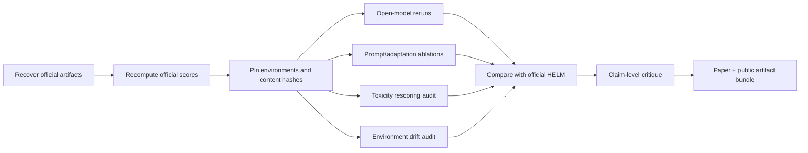
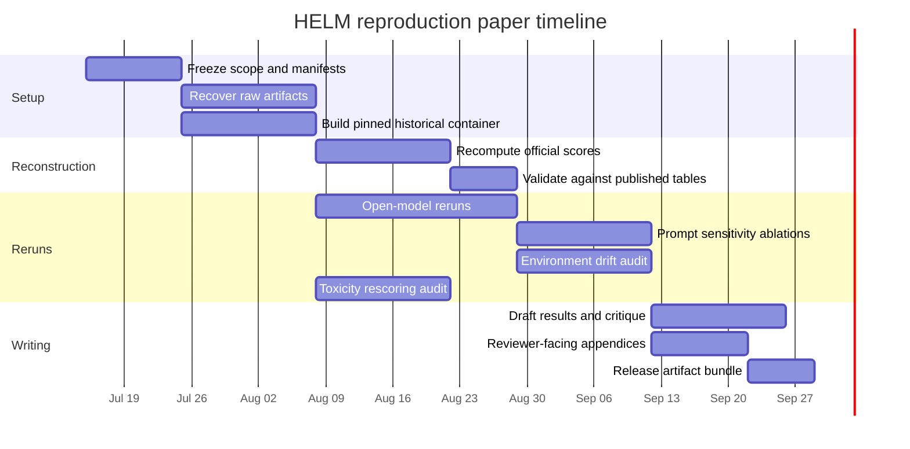

# Reproducibility of Generative AI Evaluations Through the Lens of HELM

## Executive summary

The strongest paper you can write on the reproducibility of generative AI evaluation is **not** a naïve “rerun HELM and compare scores” study. A full exact rerun of the original 2023 HELM benchmark is no longer possible because many of the original commercial or limited-access model identifiers have been retired, renamed, or replaced, while HELM itself entered maintenance mode on June 1, 2026. What **is** still possible—and scientifically more interesting—is a mixed design that combines **artifact reconstruction**, **open-model reruns**, and **forensic critique of where reproducibility breaks**. That design is well aligned with HELM’s own transparency goals and with later work showing that evaluation pipelines can drift because of prompt choices, API changes, stochastic decoding, backend differences, and even data-processing row order. citeturn7view0turn10view0turn22view0turn18view0turn19view2

HELM’s 2023 contribution was unusually ambitious for its time. The paper organized evaluation around a taxonomy of scenarios and desiderata, measured **7 metrics** across **16 core scenarios** when feasible, added **7 targeted evaluations** built from **26 targeted scenarios**, and evaluated **30 prominent language models** under standardized few-shot prompting conditions. The project reported **4,939 runs**, about **12.17 billion tokens**, **17.43 million queries**, roughly **$38,001** in commercial API spend, and about **19,500 GPU-hours** for open models. Its headline empirical messages included strong gains from instruction tuning, a persistent open-versus-non-open performance gap in that 2022–2023 snapshot, severe prompt/adaptation sensitivity, nontrivial drops under robustness/fairness perturbations, weak toxicity-detection performance, and poor correspondence between upstream perplexity and downstream task accuracy. citeturn40view0turn15view0turn16view0

As of 2026-07-14, the **best preserved HELM artifacts** are the paper, the Apache-2.0 codebase, Read the Docs documentation, the PyPI package, the public Google Cloud bucket of raw results, and public dataset mirrors such as `stanford-crfm/helm-scenarios`. The hardest part is **model access**: exact OpenAI legacy IDs like `text-davinci-002`, `text-curie-001`, `text-babbage-001`, and `text-ada-001` were shut down in January 2024; Anthropic’s original research alias `Anthropic-LM v4-s3` is not part of the current public model surface; Cohere’s 2022 dated completion models are not part of its current documented lineup; and AI21’s current first-party documentation is centered on Jamba rather than Jurassic-1. By contrast, several open checkpoints used by HELM—such as GPT-J, GPT-NeoX, T5, UL2, OPT, BLOOM, YaLM, and GLM-130B—remain obtainable, though licenses and operational burden differ substantially. citeturn7view0turn9search1turn7view2turn29view0turn29view1turn29view2turn29view3turn24search2turn25search0turn25search8turn27search0turn30search0turn30search1turn30search2turn30search4turn31search1turn33search0turn32search1turn32search2

The literature after HELM gives you a ready-made critical frame. Pozzobon et al. showed that rescoring HELM generations with a newer Perspective API changed toxicity rankings and undermined comparability across time. Choshen et al. showed that much cheaper benchmarking can preserve rank information surprisingly well, implying that large suites like HELM may often be reproducible at lower cost if designed properly. Aali et al. argued that HELM-style fixed prompts can underestimate model ceilings and even flip rankings when structured prompting is introduced. Every Eval Ever then provided the most direct reproducibility audit of HELM: three models reproduced on fourteen single-turn HELM benchmarks achieved many high-agreement cells, but still exposed failures caused by backend changes, stochastic sampling, empty-truncation artifacts, and environment-induced example mismatch. Meanwhile, broader benchmark critiques emphasized contamination, construct validity, gaming pressure, and sociotechnical incentive failures. citeturn22view0turn20view0turn21search6turn18view0turn18view2turn19view0turn36view0turn36view1turn36view2

For the reproduction paper itself, I recommend prioritizing **five experiments**. First, reconstruct official HELM subgroup tables from raw released artifacts without rerunning models. Second, rerun a selective **open-model subset** on 4–6 core tasks to test whether official scores are recoverable under pinned environments. Third, replicate HELM’s **multiple-choice adaptation sensitivity** on HellaSwag or OpenBookQA. Fourth, replicate the **toxicity drift critique** by rescoring stored HELM generations with current Perspective plus an open alternative and a small human audit. Fifth, run an **environment/provenance drift experiment** on scenarios already known to be brittle, especially entity matching and stochastic knowledge probes. This combination will let your paper argue that reproducibility in generative AI evaluation has at least **three layers**: artifact reproducibility, procedural reproducibility, and substantive reproducibility of claims. citeturn11search0turn22view0turn18view0turn18view2turn19view1

## HELM in context

HELM’s explicit aim was to improve the transparency of language-model evaluation by doing three things at once: making the evaluation space more comprehensive, standardizing how models are adapted to tasks, and releasing underlying prompts and completions for inspection. The paper framed evaluation through a taxonomy of **scenarios**—defined by task, domain, timing/circumstances, speaker, and language—and a taxonomy of **desiderata/metrics**. It then selected a broad but feasible subset rather than claiming complete coverage. citeturn13view2turn13view3turn40view0

On the concrete benchmark side, HELM measured **7 metrics**—accuracy, calibration, robustness, fairness, bias, toxicity, and efficiency—across **16 core scenarios**, achieving metric coverage on **98 of 112** possible core-scenario/metric pairs. It also added **7 targeted evaluations** built from **26 targeted scenarios** for skills and risks such as reasoning, knowledge, disinformation, copyright/memorization, and targeted harms. The core scenarios covered question answering, information retrieval, summarization, sentiment analysis, toxicity detection, and miscellaneous classification tasks; the paper’s core scenario list includes NaturalQuestions open-book and closed-book, BoolQ, NarrativeQA, QuAC, HellaSwag, OpenBookQA, TruthfulQA, MMLU, MS MARCO, TREC, XSUM, CNN/DailyMail, IMDB, CivilComments, and RAFT. citeturn40view0turn39view2turn39view1

Methodologically, HELM adapted all models with a common **few-shot prompting** approach and emphasized that adaptation itself is a major source of variance. The project used a text-to-text abstraction, standardized prompting decisions as much as possible, and computed task-appropriate accuracy metrics together with cross-cutting metrics such as **ECE-10** for calibration, perturbation-based robustness/fairness metrics, toxicity via **PerspectiveAPI with a 0.5 threshold**, and inference runtime as an efficiency measure. For summarization, the benchmark supplemented lexical overlap metrics with faithfulness-oriented tools such as **SummaC** and **QAFactEval**. citeturn15view0turn40view1turn40view2turn40view3

HELM evaluated **30 models** across open, limited-access, and closed access conditions. The paper’s model inventory includes open models such as GPT-J, GPT-NeoX, T5, UL2, OPT, BLOOM, YaLM, and GLM; limited-access models from OpenAI, Cohere, and AI21; and closed/private models such as Anthropic-LM v4-s3 and TNLG v2. The paper’s model table explicitly distinguishes organization, parameter count, tokenizer, context window, access status, approximate total tokens queried, and evaluation cost. citeturn13view1turn12view0

The main findings that matter most for a reproducibility paper are not just the leaderboard winners, but the **fragility disclosures already inside HELM**. The paper reported that instruction-tuned models performed especially strongly on core metrics; that open models trailed non-open ones in the 2022–2023 snapshot; that calibration did not move monotonically with accuracy; that robustness and fairness perturbations could cause major drops; that toxicity detection was weak even for good general-purpose models; that automated summarization metrics often failed to distinguish quality differences; that model ranking depended strongly on adaptation details; and that upstream perplexity was a poor cross-family predictor of downstream ability. It also documented that previously models had been evaluated on only **17.9%** of HELM’s core scenarios on average, whereas HELM raised that shared-coverage figure to **96.0%** under standardized conditions. citeturn15view0turn16view0

For a paper centered on reproducibility, the most important conceptual takeaway is that HELM already treated evaluation as a **software-and-protocol artifact**, not just a benchmark score. That is why the released raw prompts/completions and modular toolkit remain central to any credible reproduction or critique. citeturn8search5turn7view0

## Artifact availability in 2026

The artifact picture in mid-2026 is mixed: the **evaluation framework and raw result infrastructure are unusually well preserved**, but **exact model re-access is uneven**.

| Artifact class | What is available as of 2026-07-14 | Accessibility and licensing | Reproducibility value | Sources |
|---|---|---|---|---|
| Paper and archival record | HELM’s TMLR/OpenReview paper remains public; the arXiv/OpenReview records still expose the full technical description and appendices. | Public access. Scholarly record preserved. | Essential for reconstructing design intent, metrics, scenario definitions, and reported findings. | citeturn7view0turn5search1 |
| HELM code repository | `stanford-crfm/helm` remains public on GitHub and is licensed under Apache-2.0. | Public code; permissive license. | Primary software artifact for reruns, score recomputation, and scenario inspection. | citeturn7view0 |
| Maintenance status | HELM entered maintenance mode on 2026-06-01; code and leaderboards remain available, but no new features or new leaderboard evaluations are being added. | Public but best-effort maintenance only. | Important caveat: users should expect breakage from external API drift and must self-validate current functionality. | citeturn10view0 |
| Package distribution | The package is installable from PyPI as `crfm-helm`; the GitHub page exposed release history through at least v0.5.16 on 2026-04-30. | Public package distribution. | Useful for containerized or CI-based reproductions, but version pinning is mandatory. | citeturn7view0turn8search7 |
| Documentation | Read the Docs documentation remains live, including guides for installation, raw-result download, and leaderboard reproduction. | Public docs. | Critical for reconstructing official workflows and CLI usage. | citeturn9search0turn11search0 |
| Raw result archive | HELM stores raw result data in the public Google Cloud bucket `crfm-helm-public`; docs list project paths including `classic`, `lite`, `capabilities`, and others. The docs warn that a whole-project download is very large, with “more than 5 TB” for Classic. | Public unauthenticated read access via GCS tools. | This is the single most important artifact for exact score reconstruction without rerunning inaccessible models. | citeturn9search1 |
| Dataset mirrors | `stanford-crfm/helm-scenarios` on Hugging Face mirrors datasets used as HELM scenarios. The mirror page explicitly states that it contains mirrors of datasets used by HELM, and shows that licenses vary by dataset. | Public mirror; per-dataset licenses vary. | Reduces link rot and broken original URLs, but each dataset still needs scenario-level provenance checks. | citeturn7view2 |
| Public prompt/completion transparency | HELM states that it publicly released raw model prompts and completions, in addition to the toolkit. | Public transparency claim supported by released artifacts. | Enables forensic reproduction, content hashing, and metric recomputation even when models are gone. | citeturn8search5turn9search1 |
| Cross-framework export layer | Every Eval Ever includes converters for HELM and a public datastore/schema for evaluation result sharing. | Public open repository and schema. | Very useful for audit-style reproduction, metadata normalization, and side-by-side comparison with local reruns. | citeturn17view0turn6search9 |

A second inventory concerns **model accessibility**, because this is where exact reruns begin to fail.

| Model family in original HELM | 2026 accessibility picture | Practical reproduction judgment | Sources |
|---|---|---|---|
| OpenAI legacy InstructGPT/completions models (`text-ada-001`, `text-babbage-001`, `text-curie-001`, `text-davinci-002`) | OpenAI’s official deprecations page says these models were shut down on 2024-01-04. OpenAI later retained replacement base models like `davinci-002`, but not the original `text-*` IDs used in HELM. | **Exact rerun infeasible** for original IDs. Functional approximations possible, but not exact reproduction. | citeturn29view0turn29view1turn29view2turn29view3 |
| OpenAI base replacements (`davinci`, `curie`, `babbage`, `ada`) | The original base GPT models were also shut down on 2024-01-04; replacements were `davinci-002`/`babbage-002`, which are themselves on a deprecation path with shutdown on 2026-09-28. | **Historical continuity only partial**; exact model-serving stack differs. | citeturn29view0turn28view0 |
| Anthropic research alias (`Anthropic-LM v4-s3`) | Anthropic’s current public docs expose Claude model IDs and model lifecycle docs, but not the 2022 HELM research alias. | **Appears infeasible** without Anthropic internal access or archived private endpoints. | citeturn24search2turn24search5turn24search12 |
| Cohere dated 2022 completion models | Cohere’s current model pages and deprecation docs focus on the Command family and an active deprecation lifecycle; the 2022 dated completion IDs used in HELM are not part of the current documented surface. | **Exact rerun likely infeasible** through current first-party API. | citeturn25search0turn25search8 |
| AI21 Jurassic-1 family (`J1-Large`, `J1-Grande`, `J1-Jumbo`) | AI21’s current docs are centered on Jamba and current platform availability; Jurassic-1 remains historically documented in blog/white-paper form but is not a current first-party docs surface. | **Exact first-party rerun likely infeasible**; treat as historically documented, not operationally reproducible. | citeturn26search2turn27search0turn26search10 |
| Microsoft/NVIDIA TNLG v2 and other closed/private models | HELM listed TNLG v2 as closed access; there is no public checkpoint or current public rerun interface in the HELM documentation. | **Exact rerun infeasible**. | citeturn13view1 |
| GPT-J 6B and GPT-NeoX 20B | Hugging Face model cards remain public; both pages show Apache-2.0 licensing and runnable instructions. | **Good candidates for exact or near-exact open reruns**, modulo library/backend drift. | citeturn30search0turn30search1 |
| T5 11B and UL2 20B | Public Google/Hugging Face model pages remain available. | **Good candidates for open reruns**; sequence-to-sequence serving details must be pinned carefully. | citeturn30search4turn31search1turn31search8 |
| OPT 66B / OPT 175B | Meta’s OPT family remains publicly documented; the model family was released responsibly, and access to larger checkpoints was historically regulated under the OPT-175B license. | **Reproducible but operationally expensive**; license review still needed, especially for the largest checkpoints. | citeturn33search0turn33search3turn33search9 |
| BLOOM 176B | BigScience BLOOM remains public on Hugging Face under a RAIL-style license. | **Reproducible but legally and operationally nontrivial**; excellent stress test for artifact completeness. | citeturn30search2turn30search12 |
| YaLM 100B and GLM-130B | YaLM 100B remains public and marked Apache-2.0 on Hugging Face; GLM-130B’s repo is public, but the model weights have a more restrictive model license for non-commercial research. | **Technically rerunnable**, but GLM requires closer license screening and both require major compute. | citeturn32search1turn32search17turn32search2turn32search5 |

The practical implication is straightforward: your paper should distinguish **exact reproduction of released scores from released artifacts** from **fresh reruns of surviving open models** and from **functional replication of claims using replacement APIs**. Treating those as the same thing would obscure the most important scientific issue. citeturn10view0turn18view0

## Subsequent critiques and replications

The post-HELM literature does not merely complain that benchmarking is hard. It identifies **specific technical mechanisms** by which HELM-style evaluation can fail to reproduce or can reproduce only partially.

| Work | Type | Methodology | Main outcome | Why it matters for your paper | Sources |
|---|---|---|---|---|---|
| Pozzobon et al., *On the Challenges of Using Black-Box APIs for Toxicity Evaluation in Research* | Peer-reviewed EMNLP 2023 | Rescored prior text with a newer Perspective API; analyzed RTP, HELM toxicity rankings, and toxicity-mitigation literature. | Reported a **49% relative decrease** in toxic prompts in rescored RTP; **13 HELM models changed results**, producing **24 ranking changes** on Toxic Fraction. | Strongest HELM-specific critique of metric drift through an external black-box evaluator. | citeturn22view0 |
| Choshen et al., *Efficient Benchmarking of Language Models* | Peer-reviewed NAACL 2024 | Studied benchmark reliability under reduced sampling budgets and proposed active-testing-style efficiency methods on HELM. | Showed HELM ranks remain surprisingly stable under severe compute reduction, often yielding **x100 or more** cost savings with little loss of reliability. | Lets you propose a reproducible low-cost replication tier instead of a full expensive rerun. | citeturn20view0 |
| McIntosh et al., *Inadequacies of Large Language Model Benchmarks in the Era of Generative AI* | Journal/preprint-style broad critique, 2024 | Reviewed 23 LLM benchmarks through people/process/technology lenses. | Identified implementation inconsistencies, prompt complexity, evaluator diversity issues, cultural blind spots, and the difficulty of measuring “genuine reasoning.” | Provides a broad critical frame in which HELM is a sophisticated but still incomplete benchmark. | citeturn36view2 |
| Eriksson et al., *Can We Trust AI Benchmarks?* | Meta-review, 2025 | Interdisciplinary review of about 100 benchmark-critique studies. | Argues that benchmark practice is shaped by misaligned incentives, construct-validity issues, gaming, cultural dynamics, and documentation gaps. | Excellent source for the policy and incentives section of your paper. | citeturn36view1 |
| Aali et al., *Structured Prompting Enables More Robust, Holistic Evaluation of Language Models* | Preprint / OpenReview 2025–2026 | Integrated DSPy-style structured prompting into HELM across several benchmarks and models. | Reported that baseline HELM-style prompting **underestimated performance by about 4% on average**, increased variance, and even **flipped rankings on 3 of 7 benchmarks**. | Direct evidence that “same model, same task” can change materially under different admissible prompting choices. | citeturn21search6turn21search1 |
| Batzner et al., *Every Eval Ever* | Preprint / community infrastructure paper, 2026 | Converted official HELM records and local reruns into a common schema; reproduced 3 models on 14 HELM benchmarks at instance level. | Found many high-agreement cells, but also failures from **row-order dependence**, **backend differences**, **stochastic generation**, and **empty-truncation artifacts**. | This is the most useful direct template for your own reproducibility protocol. | citeturn18view0turn18view2turn19view0 |
| *Pitfalls of Evaluating Language Models with Open Benchmarks* | Preprint, 2026 | Constructed “cheating” models and tested benchmark gaming on HELM-like open settings. | Argues that public open benchmarks can be gamed through memorization, and that leaderboard results need private/dynamic complements. | Strong policy-relevant critique of openness-versus-integrity trade-offs. | citeturn36view0 |

Two patterns emerge from this literature. First, **HELM’s transparency was a genuine advance**, because it made later forensic critique possible rather than impossible. Second, **reproducibility failures are layered**. Some are caused by **artifact incompleteness**; some by **environment drift**; some by **metric implementations outside HELM**, such as PerspectiveAPI; some by **prompt/adaptation choice**; and some by **the benchmark’s very openness**, which creates contamination and gaming risks. citeturn22view0turn18view2turn36view0turn36view1

That layered picture suggests that your critique should be sharper than “HELM is not reproducible.” A better thesis is: **HELM is unusually reproducible at the artifact level, partially reproducible at the protocol level, and only conditionally reproducible at the claim level.** That framing is both fairer to HELM and more analytically useful. citeturn8search5turn9search1turn18view0

## Reproducibility plan

The best reproduction package is a **tiered program of evidence**, with exact reconstruction where possible and interpretive replication where exact reruns are impossible.

The workflow above is the right order because released artifacts should be the **ground truth for official HELM**, while reruns should be used to assess **protocol stability**, not to overwrite the historical record. That ordering is exactly what later forensic work on HELM found necessary when backend, environment, or decoding details were underspecified. citeturn9search1turn18view2turn19view1

| Priority experiment | Core question | Recommended models and tasks | Exact metrics | Resource tier | Expected challenge | Mitigation |
|---|---|---|---|---|---|---|
| Official score reconstruction | Can you rebuild official HELM subgroup tables and metrics from released raw outputs alone? | No reruns. Use official Classic raw records from GCS plus HELM code matching the closest release. Focus on MMLU, BoolQ, IMDB, CivilComments, XSUM, NarrativeQA. | Match official aggregate scores exactly or to floating-point tolerance; compare metric JSONs and leaderboard tables. | **No-cost / low-cost** | Storage and schema complexity; Classic is huge. | Start from selected suites only; do not download all of Classic. Use content hashes and a manifest-first workflow. |
| Open-model core rerun | How stable are open-model HELM results under a fully pinned 2026 rerun? | GPT-J 6B, GPT-NeoX 20B, T5 11B, UL2 20B; optionally OPT 66B if compute allows. Tasks: BoolQ, MMLU, IMDB, CivilComments, XSUM. | EM/accuracy where applicable; ECE-10; robustness/fairness metrics where implemented; ROUGE-2/faithfulness for XSUM; runtime. | **Academic** | Backend/tokenizer/library drift versus 2023 execution. | Pin old Python/Transformers/NumPy/Pandas stacks; also run a “modern stack” condition to measure drift explicitly. |
| Multiple-choice adaptation study | Do HELM’s ranking and accuracy claims hold under alternate admissible prompt adaptations? | HellaSwag and OpenBookQA on GPT-J, GPT-NeoX, OPT 66B, UL2. Compare joint vs separate prompting, 0-shot vs 5-shot, exemplar permutations. | Accuracy/EM, ECE-10, rank correlation, variance across prompt seeds. | **Low to academic** | Prompt sensitivity can dominate score differences. | Treat prompt format as an experimental factor, not nuisance noise; report distributions, not one score. |
| Toxicity drift audit | Are HELM’s toxicity conclusions stable under evaluator changes and time? | Use released HELM generations on RealToxicityPrompts/BOLD; rescore with current Perspective API plus one open toxicity model; manually audit a stratified sample. | Toxic fraction at 0.5 threshold for Perspective; agreement rates between evaluators; Kendall/Spearman rank correlation across models; confusion analysis on audited sample. | **Low to medium** | External evaluator drift and construct disagreement. | Preserve original scores, add rescored columns, and label evaluator version/date as first-class metadata. |
| Environment/provenance audit | Can identical HELM recipes yield different instance sets or outputs under different software stacks? | Reproduce EntityMatching, SyntheticReasoning-Natural, and WikiFact following the Every Eval Ever audit logic. | Instance overlap by content hash; per-instance score agreement; aggregate agreement; join-failure counts. | **Academic** | Row-order drift, stochastic decoding, truncated outputs, backend difference. | Content-hash joins, seed pinning, archive intermediate scenario state, and preserve all raw completions. |

For the **step-by-step execution plan**, I recommend this sequence. First, build a frozen manifest that records the exact HELM git commit or PyPI version, the exact schema files, the specific scenario subsets, and every external dependency. Second, pull only a **minimal raw-results slice** from the GCS bucket and verify that your local recomputation exactly reproduces official aggregates. Third, create a containerized replay environment with both a “historical” stack and a “modern” stack. Fourth, rerun the open-model subset. Fifth, run the prompt-sensitivity and environment-drift studies. Sixth, execute the toxicity-rescoring audit. Seventh, convert all official and reproduced outputs into a common exchange format such as Every Eval Ever so that instance-level differences are queryable and archivable. citeturn11search0turn9search1turn17view0turn18view0

One important design choice is **what to treat as success**. I recommend three success levels. **Level one** is exact reconstruction of official released numbers from official released artifacts. **Level two** is high agreement for open-model reruns under pinned environments, with deviations explained by decoding/backend or software differences. **Level three** is claim-level stability: the qualitative findings should survive even when exact numbers do not. HELM’s own paper, the toxicity-rescoring critique, and the EEE audit all suggest that claim-level stability is the right scientific target when exact endpoint recovery is impossible. citeturn15view0turn22view0turn19view2

## Protocol and infrastructure

A reproducibility paper on HELM should itself model exemplary practice. The protocol should be explicit enough that a reader could determine whether a disagreement is due to **data**, **prompting**, **metric code**, **serving backend**, **model availability**, or **stochasticity**.

| Protocol item | What to record | Why it matters | Sources |
|---|---|---|---|
| Code identity | HELM repo commit or PyPI version; local patches; schema and run-entry files. | HELM’s own reproduction docs point to configuration files as the authoritative recipe. | citeturn11search0turn7view0 |
| Environment identity | OS image, container digest, Python version, package lockfile, CUDA/cuDNN, core libraries such as Pandas/NumPy/Transformers. | EEE found row-order and environment effects that changed instance selection itself. | citeturn18view2 |
| Dataset provenance | Source URL or mirror, file hashes, retrieval date, preprocessing scripts, row-order assumptions, train/dev/test split IDs. | Later forensic work showed that identical “recipes” can hide differing example sets. | citeturn7view2turn18view2 |
| Model identity | Exact checkpoint tag or API model ID, provider, access mode, deployment backend, precision/quantization, tokenizer version. | EEE showed backend/display-layer differences can change outputs even with the same nominal model. | citeturn17view0turn19view1 |
| Decoding configuration | Temperature, max tokens, stop sequences, number of outputs, top-p/top-k, repetition penalties, seed. | WikiFact and SyntheticReasoning-Natural mismatches were directly tied to decoding/stochasticity and truncation. | citeturn19view1turn19view2 |
| Prompt identity | Full prompt text, in-context examples, ordering, adaptation method, prompt-family label. | HELM and later prompting work both show prompt design can materially alter rankings. | citeturn16view0turn21search6 |
| Metric semantics | Exact formula, threshold, normalization, aggregator, confidence-interval method. | Toxicity score thresholds and calibration metrics are especially version-sensitive. | citeturn40view1turn40view3turn22view0 |
| Instance-level outputs | Raw completions, extracted answer, score, per-instance metadata, content hash. | Necessary for reproducibility forensics rather than simple leaderboard viewing. | citeturn17view0turn18view0 |
| Statistical reporting | Bootstrap CIs, paired significance tests where appropriate, and rank-correlation analyses on model orderings. | Benchmark conclusions are often about relative ordering, not just absolute scores. | citeturn20view0turn36view1 |

For **statistical tests**, I would recommend the following as part of your paper’s own protocol. Use **paired bootstrap confidence intervals** at the instance level for task metrics such as accuracy or ROUGE. Use **McNemar tests** for paired classification disagreements where the same instance set is preserved. Use **Kendall’s tau or Spearman correlation** for ranking stability across model lists. Use **hierarchical bootstrap** when multiple prompt seeds or exemplar permutations are treated as part of the evaluative uncertainty, which they should be in your prompt-ablation study. These are methodological recommendations rather than claims about HELM’s original test suite, so present them as your protocol choices. HELM itself already highlights that correlation structure and prompt-induced variance matter materially. citeturn16view0turn40view1

For tooling, the most useful stack is one that separates **evaluation execution**, **artifact versioning**, **schema normalization**, and **experiment tracking**.

| Need | Recommended tooling | Why it fits this project | Cautions | Sources |
|---|---|---|---|---|
| Native HELM reproduction | HELM itself | It is the authoritative implementation and includes official reproduction docs and raw-result compatibility. | Maintenance mode means you should expect to maintain local patches. | citeturn7view0turn10view0turn11search0 |
| Cross-check harness | EleutherAI `lm-evaluation-harness` | Strong secondary harness for sanity-checking a subset of open tasks and prompts. | Task definitions are not identical to HELM’s; do not mix scores without schema normalization. | citeturn34search0turn34search5 |
| Scenario modularization and evaluation cataloging | Unitxt | Useful for standardized data/metric composition and for publishing evaluation recipes beyond HELM. | Not a drop-in replacement for HELM’s historical execution semantics. | citeturn34search2turn34search17 |
| Richer modern eval orchestration | Inspect AI | Good for writing auditable evaluation logic and preserving logs. | Better for new studies than for exact historical HELM replay. | citeturn34search1turn34search6 |
| Data/model artifact versioning | DVC or equivalent Git-linked data versioning | Strong fit for dataset hashes, intermediate outputs, and release bundles. | Adds process overhead; worth it here because raw outputs are central evidence. | citeturn34search9turn34search19 |
| Run tracking and comparisons | MLflow | Open-source, mature run tracking, model/eval logging, and dashboarding. | You must still export stable archival artifacts outside MLflow. | citeturn34search3turn34search8 |
| Cross-paper archival schema | Every Eval Ever | Best current option for publishing normalized aggregate and instance-level results from HELM-style reruns. | Still a young standard, so include redundant archival formats as well. | citeturn17view0turn6search9 |

The implementation roadmap should be incremental. In the first phase, freeze software, manifests, and a minimal data slice. In the second, reproduce official metrics from raw artifacts. In the third, add open-model reruns. In the fourth, add ablations and forensic audits. In the fifth, publish a release bundle containing code, lockfiles, containers, schema-normalized results, and a human-readable appendix. That order keeps the project from collapsing under compute or storage demands before the core reproducibility claims are secured. citeturn9search1turn20view0turn17view0

## Incentives, policy, and community practice

The main barriers are not only technical. They are also **institutional** and **cultural**.

The first barrier is that public benchmarks create a strong incentive to optimize for **leaderboard position** rather than robust scientific understanding. Broader benchmarking critiques argue that benchmark ecosystems are shaped by competitive dynamics, marketing pressure, and construct-validity shortcuts. The later open-benchmark gaming literature makes the same point more directly: transparency improves auditability but can worsen contamination and memorization incentives if benchmarks are static and public for too long. citeturn36view1turn36view0

The second barrier is **API opacity**. HELM’s black-box design made broad comparison possible, but later work showed exactly how that choice weakens longitudinal reproducibility. If the model provider changes a model or an evaluator without robust versioning and changelogs, the community can inherit unstable comparisons. Toxicity evaluation is the cleanest example because a single external API—Perspective—can alter old rankings when rescored later. citeturn22view0

The third barrier is **maintenance economics**. HELM itself has now entered maintenance mode, and its docs explicitly warn that many scenarios and models depend on external APIs that may change incompatibly over time. That is not a HELM-specific failing so much as a sign that benchmark maintenance is underfunded relative to benchmark creation and benchmark publicity. citeturn10view0

The fourth barrier is **artifact under-specification**. Every Eval Ever’s HELM audit shows that even when many artifacts are technically released, critical information may still be absent from the canonical score record: which backend actually served a nominally identical model, how prompt/example identity should be aligned, whether decoding stored one output or five, and whether trimming rules changed the effective completion. That is a metadata problem as much as a compute problem. citeturn18view2turn19view1

A strong policy section in your paper can therefore make several concrete proposals. First, require a **benchmark release bundle** for any flagship leaderboard update: raw instance-level outputs, prompts, evaluation configuration, content hashes, environment lockfiles, and scorer versions. Second, treat **model-provider identifiers and evaluator-provider identifiers as separate first-class versioned objects**. Third, require **claim-tier labeling** in benchmark papers: exact reproduction, functional replication, or claim-level replication. Fourth, ask conference reviewers to check a short **evaluation reproducibility checklist** alongside existing artifact badges. Fifth, encourage benchmarks to publish both **open static sets** and **rotating/private audit sets** so that transparency and gaming resistance are balanced rather than treated as mutually exclusive. These proposals are a direct synthesis of HELM’s strengths, the toxicity rescoring critique, the EEE audit, and broader benchmark-policy reviews. citeturn8search5turn22view0turn17view0turn36view1turn36view0

## Paper blueprint, timeline, and budget

The paper should present itself as both a **reproduction study** and a **position paper grounded in empirical audits**. A clean structure would look like this:

| Suggested paper section | What it should contain |
|---|---|
| Introduction | Why generative-AI evaluation reproducibility matters; why HELM is the right anchor case. |
| Background on HELM | Taxonomy, model/task coverage, artifact-release philosophy, and original findings. |
| Reproducibility framework | Distinguish artifact, protocol, and claim-level reproducibility. |
| Experimental design | Five-priority reproduction plan, access tiers, and evaluation protocol. |
| Results | Official artifact reconstruction, open-model reruns, prompt-sensitivity study, toxicity drift audit, environment/provenance audit. |
| Discussion | What reproduced exactly, what did not, and why. |
| Position argument | Standards for benchmark publication, review, and maintenance. |
| Appendices | Full manifests, lockfiles, dataset provenance, model cards/licenses, prompt templates, scorer definitions, statistical details, and artifact bundle inventory. |

The timeline below assumes one lead author with light research engineering support. It is intentionally staged so that the lowest-risk, highest-value tasks happen first.

A realistic planning table is below.

| Scenario | Scope | Direct cash cost assumption | Compute assumption | Human labor assumption | Best use case |
|---|---|---:|---|---|---|
| No-cost | Official score reconstruction, small-slice open reruns on GPT-J/T5-class models, limited toxicity rescoring, no large-model rental. | **$0–$500** | Local workstation, donated lab compute, or public/free community credits. | 1 primary researcher, ~6–8 weeks part-time equivalent. | Seminar paper, workshop paper, methods note. |
| Academic | Full five-experiment plan with GPT-J, GPT-NeoX, T5/UL2, some OPT-66B access, moderate storage, small human audit sample. | **$2,500–$10,000 equivalent** | University GPU allocation plus modest cloud spillover. | 1 lead author + 1 research engineer + 1 annotator pool coordinator for ~8–12 weeks. | Strong conference or journal submission. |
| Commercial | Broader reruns, heavier OPT/BLOOM-class experiments, larger human audit, extensive artifact hosting and CI. | **$15,000–$40,000+** | Dedicated rented A100/H100-class infrastructure plus storage and annotation budget. | Small team over 2–3 months. | Flagship methods paper or institutional benchmark report. |

These budget ranges are **scoping estimates**, not vendor quotes. They are grounded mainly by two empirical anchors: HELM’s original cost envelope—which was very large at roughly **$38k in commercial API spending plus ~19,500 GPU-hours**—and later work showing that much of the ranking signal can often be preserved with dramatically fewer inference calls, sometimes by **two orders of magnitude**. The implication is that a modern reproduction paper does **not** need to recreate HELM’s full expense profile to be rigorous. citeturn15view0turn20view0

A final planning table can help tie experiments, resources, and expected duration together.

| Experiment | Low-resource duration | Academic duration | Commercial duration | Most likely bottleneck |
|---|---:|---:|---:|---|
| Official score reconstruction | 1–2 weeks | 1 week | <1 week | Artifact organization and schema understanding |
| Open-model core rerun | 2–3 weeks | 1–2 weeks | 1 week | GPU queue time and environment pinning |
| Multiple-choice prompt study | 1–2 weeks | 1 week | 1 week | Experiment combinatorics |
| Toxicity drift audit | 1–2 weeks | 1–2 weeks | 1–2 weeks | Evaluator disagreement and human audit setup |
| Environment/provenance audit | 1–2 weeks | 1–2 weeks | 1 week | Recovering historical stack behavior |
| Writing and appendices | 2 weeks | 2 weeks | 2 weeks | Consolidating claims and artifacts |

The paper’s argumentative conclusion should be clear and non-defensive: **HELM remains one of the best historical case studies precisely because it released enough evidence for later scholars to discover where evidence alone was still insufficient.** That is the right center of gravity for a rigorous paper on reproducibility in generative AI evaluation. citeturn8search5turn17view0turn18view0