# Experiments and Results — complete dump

**Compiled 2026-07-27.** Covers everything from the start of the internship
(2026-05-15) to now.

**Purpose.** This is a *dump*, not an argument. It exists so collaborators can see
what has actually been run, what numbers came out, where the artifacts live, and
what is missing — and then decide what else needs to be there. Interpretation is
kept to the minimum needed to make a number legible; the argument lives in the
[Master Collaborative Reference](../Master_Collaborative_Reference_2026-07-27/) and
the [TMLR draft](../papers/tmlr-2026/).

**Sources.** Three, cross-checked against each other:

1. `docs/Master_Collaborative_Reference_2026-07-27/` (chronicle + ledgers)
2. **The `/data` stores on this host** (`crfm-helm-audit`, `crfm-helm-audit-store`,
   `crfm-helm-public`, `dkps-embeddings`) — every number below marked *(disk)* was
   read off these directly today, not copied from prose
3. `docs/internship-powerpoints.zip` — seven weekly decks, 2026-06-02 … 2026-07-14

Where the three disagree, §8 says so explicitly. **Four of those disagreements
matter and are listed there — read §8 before citing anything.**

---

## 1. Inventory at a glance

### 1.1 Execution totals *(disk)*

| item | count |
|---|---|
| Experiment directories under `/data/crfm-helm-audit` | 74 |
| Local HELM runs with complete raw artifacts (`run_spec.json` + `scenario_state.json`) | **1,634** |
| Deployment-match sweep directories | 26 (19 with a scored ranking) |
| Open-judge rejudge attempts (all `DONE`) | 75 (63 full + 12 smoke) |
| Virtual experiments with a built aggregate report | 12 |
| Per-run core-metric reports | 703 (Qwen) + 149 (OLMo) + 4 (GPT-OSS) + 29 early-experiment sets |
| Plots on disk across all reports | ~8,900 PNG/JPG |

### 1.2 Experiments by thread

| # | Experiment | Kind | Date | Runs | Report? | Headline |
|---|---|---|---|---|---|---|
| **A. HELM reproduction** ||||||
| A1 | Corpus cartography | Analysis | 06-09 → 06-17 | 34,512 records | ✅ | 1,109 of 34,512 runs eligible |
| A2 | phi-2 e2e instrument validation | Reproduction | 05-27 → 06-29 | 5 variants | ✅ | 0.997 vLLM / 0.990 HF / 0.778 negative control |
| A3 | OLMo campaign (combined) | Reproduction | 06-12 → 07-14 | 225 jobs | ✅ | 0.935 mean agreement; ifeval +0.10 outlier |
| A4 | Qwen reproduction (combined) | Reproduction | → 07-20 | 775 jobs | ✅ | **0.975 mean agreement, 159 runs exact** |
| A5 | GPT-OSS-20B from-spec | Reproduction | 07-11 → 07-14 | 12 jobs | ✅ | 0.850 mean; drift ~25× tighter than OLMo ifeval |
| A6 | Era-pinned classic (RedPajama) | Reproduction | 07-08 → 07-13 | 2 eras × 2 runs | ✅ | mmlu 1.000, synthetic_reasoning 0.817, both eras identical |
| A7 | Deployment-match sweeps | Probe | 07-07 → 07-23 | 19 scored sweeps | tables | fp32 wins every unpinned-dtype family tested |
| A8 | fp32 substrate closure | Probe + e2e | 07-21 → 07-23 | 2 e2e + 4 probes | tables | **539/541 byte-identical at full N** |
| A9 | Qwen3.5-9B-Base extension | Compute | 07-16 → 07-17 | 72 runs | ❌ **no report** | MMLU 0.810 (57 subj); 52% `<think>` leakage on boolq |
| A10 | Early / pre-split experiments | Mixed | 04-28 → 05-20 | ~350 runs | partial | mostly superseded; 3 grids have reports |
| **B. Open judges** ||||||
| B1 | Identity-replay gate | Reconstruction | 07-18 | 6 benchmarks | ✅ | **6/6 exact, max err 1.95e-14** |
| B2 | Judge substitution v1 | Substitution | 07-19 | 2 judges × 2 bench × 3 reps | ✅ | κ 0.936 vs official's own 0.829 |
| B3 | Judge-size sweep | Substitution | 07-20 → 07-21 | 63 attempts | ⚠️ stale | parse rate tracks size, calibration does not |
| **C. Efficient benchmarking** ||||||
| C1 | mRMR tutorial replication | Method | 06-02 → 06-16 | 4 datasets | decks only | reproduced the paper's method ranking |
| C2 | DKPS vs baselines | Method | 06-16 → 06-23 | med_qa | decks only | DKPS loses at 20 models, closes with more |

---

## 2. Thread A — HELM reproduction

### A1. Corpus cartography (Stage 1 filtering)

**What.** Crawl the public HELM mirror, extract per-run metadata, apply eligibility
filters, emit a typed-reason census.
**Artifact.** `/data/crfm-helm-audit-store/analysis/filter_inventory.json` (80 MB,
generated 2026-06-17). Also reported in the 06-09 deck.

**Results *(disk, recomputed today)*.**

| quantity | value |
|---|---|
| Total run records | **34,512** |
| Selected (eligible) | **1,109** |
| Excluded | 33,403 |
| Distinct models in the universe | 366 |
| Distinct benchmarks in the universe | 185 |
| Distinct models in the selected set | **33** |
| Distinct benchmarks in the selected set | **61** |
| Structurally incomplete | 14 |
| Eligible but out of scope | 30 |

**Exclusion reasons** (runs can carry several):

| reason | runs |
|---|---|
| no-local-helm-deployment | 29,997 |
| not-open-access | 18,781 |
| excluded-tags | 17,526 |
| too-large (>10B params) | 7,624 |
| not-text-like | 6,024 |
| missing-model-metadata | 2,894 |
| requires-closed-judge | 484 |
| requires-gated-dataset | 74 |
| structurally-incomplete | 14 |

**By public track** (universe → selected): classic 8,377→159 · lite 2,548→167 ·
mmlu 4,565→399 · mmlu-winogrande-afr 1,012→220 · thaiexam 140→70 · medhelm 871→56 ·
capabilities 385→12 · safety 431→4 · vhelm 9,873→0 · heim 1,992→0 · audio 1,737→0.

**Grid coverage** (06-09 deck): full grid 78,690 points (366 models × 215 scenarios),
6,844 populated; filtered grid 2,013 points (33 × 61), 198 populated.

> ⚠️ **Every eligibility number in the paper traces to this one file, which is
> dated 2026-06-17 and is not regenerated from a checked-in manifest.** It is the
> single most-cited and least-refreshed artifact in the project. See §8.2 for a
> figure it contradicts.

---

### A2. phi-2 end-to-end instrument validation

**What.** Deliberately-controlled reproduction of one public run
(`mmlu:subject=philosophy,model=microsoft/phi-2`) under four deployments, plus one
**negative control** (temperature 1) that *should* fail. This is the audit
instrument validating itself.
**Artifacts.** `/data/crfm-helm-audit-store/virtual-experiments/e2e-phi2*` (5 report
trees), runs under `/data/crfm-helm-audit/e2e-phi_2-*`.

**Results *(disk)* — agreement ratio at abs_tol=0:**

| variant | deployment | agreement | bucket |
|---|---|---|---|
| `e2e-phi2-vllm` | vLLM, temp 0 | **0.997** | high |
| `e2e-phi2-container` | vLLM in container, temp 0 | **0.994** | high |
| `e2e-phi2-hf` | HuggingFace, temp 0 | **0.990** | high |
| `e2e-phi2` (first pass) | 8 jobs, 1 analyzed | 0.804 | moderate |
| `e2e-phi2-incomparable` | vLLM, **temp 1** (negative control) | **0.778** | low ✅ *expected* |

The control working is the point: the instrument separates a reproduction from a
deliberately-broken one, and the container adds ~0.003 rather than changing the
verdict.

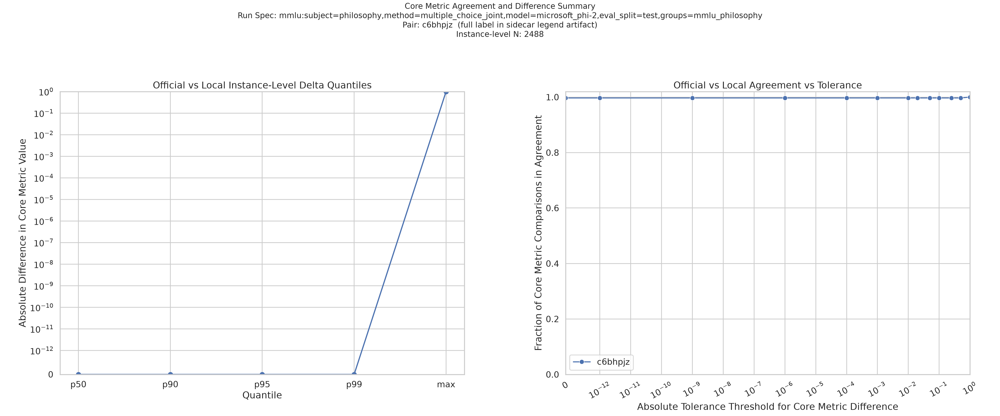
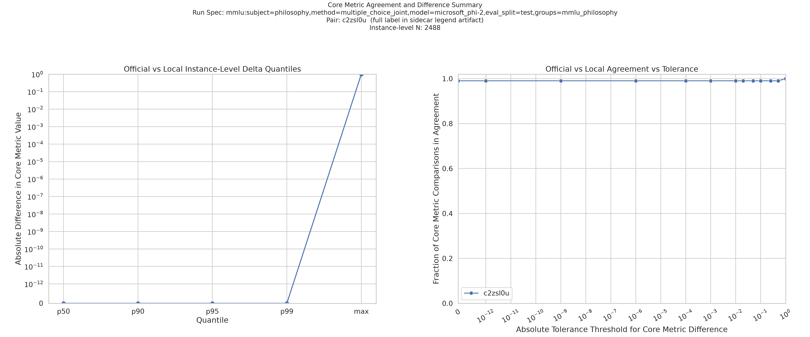
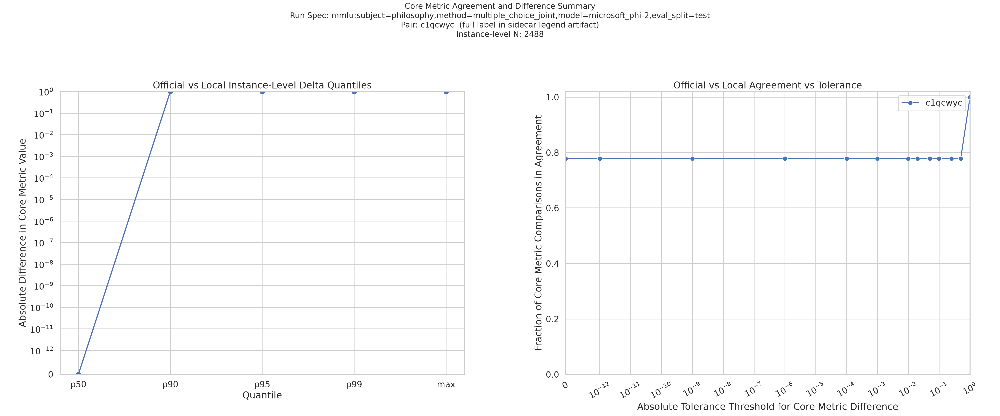

**Three instrument bugs this found and fixed** (06-02 deck): hard-coded infer-stack
ports invisible to HELM; the `groups=` flag blocking otherwise-comparable public runs
from matching; HELM stripping `temperature` from the run *name* so temp-bearing runs
could not be located.

---

### A3. OLMo campaign

**What.** Six OLMo models against their public HELM runs. The project's central case
study and the vehicle for most of the machinery.
**Artifacts.** `virtual-experiments/olmo-models-combined` (report regenerated
2026-07-14 16:25 UTC); runs under `/data/crfm-helm-audit/audit-allenai-olmo-*`
(**73 + 114 + 114 + 76 + 33 + 6×4 runs with full raw artifacts on disk**).

**Coverage *(disk)*.** 225 jobs → 220 with run artifacts → 149 analyzed.
5 failures, all `unknown_failure`. All on `aiq-gpu`.

**Reproducibility buckets:** high (≥0.95) 79 · moderate (≥0.80) 56 · exact 7 · low 7.

**Agreement at abs_tol=0 *(disk, 149 runs)*:** mean **0.935**, median 0.952,
min 0.673, 7 runs at 1.000. Relaxing to abs_tol=0.1 moves the mean only to 0.939 —
**the disagreement is structural, not numerical-tolerance.**

**Per-benchmark agreement *(disk)*:**

| benchmark | runs | mean | median | min |
|---|---|---|---|---|
| ifeval | 4 | 0.728 | 0.725 | 0.673 |
| gpqa | 4 | 0.732 | 0.712 | 0.688 |
| mmlu_pro | 4 | 0.821 | 0.816 | 0.802 |
| wmt_14 | 5 | 0.870 | 0.882 | 0.799 |
| commonsense | 1 | 0.926 | — | — |
| med_qa | 1 | 0.936 | — | — |
| bbq | 4 | 0.942 | 0.936 | 0.927 |
| narrative_qa | 1 | 0.948 | — | — |
| mmlu | 119 | 0.954 | 0.965 | 0.845 |
| legalbench | 5 | 0.973 | 0.962 | 0.949 |
| gsm | 1 | 0.990 | — | — |

**Aggregate score drift, official vs local *(disk)*** — mean |diff| **0.0312**,
median 0.0138, max 0.1257 over 24 headline cells:

| benchmark | cells | mean abs diff | max |
|---|---|---|---|
| **ifeval** | 4 | **0.1121** | 0.1257 |
| gpqa | 4 | 0.0252 | 0.0448 |
| bbq | 4 | 0.0232 | 0.0490 |
| commonsense | 1 | 0.0180 | — |
| mmlu_pro | 4 | 0.0160 | 0.0260 |
| med_qa | 1 | 0.0080 | — |
| mmlu | 2 | 0.0052 | 0.0085 |
| legalbench | 1 | 0.0034 | — |
| narrative_qa | 1 | 0.0023 | — |
| wmt_14 | 1 | 0.0006 | — |
| gsm | 1 | 0.0000 | — |

The four worst cells are all ifeval, all same-signed (local **above** official):
13B 0.7298→0.8555 (+0.1257) · 32B 0.7797→0.9014 (+0.1217) · OLMoE 0.6285→0.7314
(+0.1029) · 7B 0.6929→0.7911 (+0.0983). **That single cell is what experiment A8
resolves.**

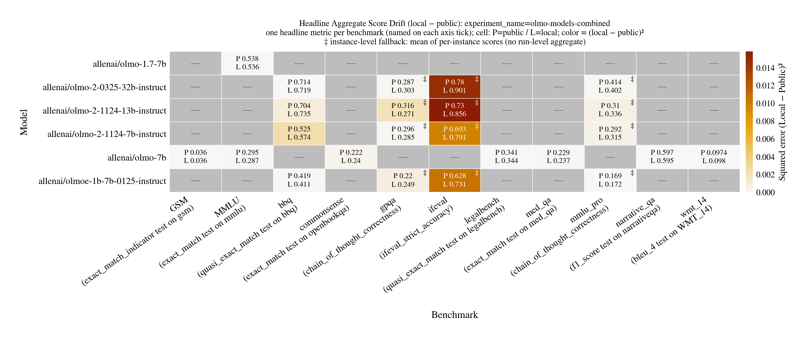
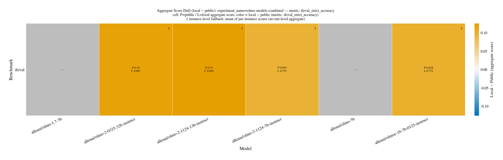
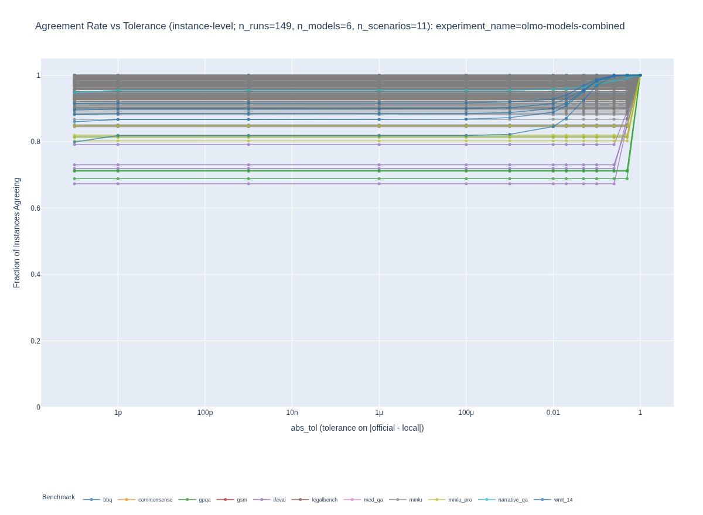
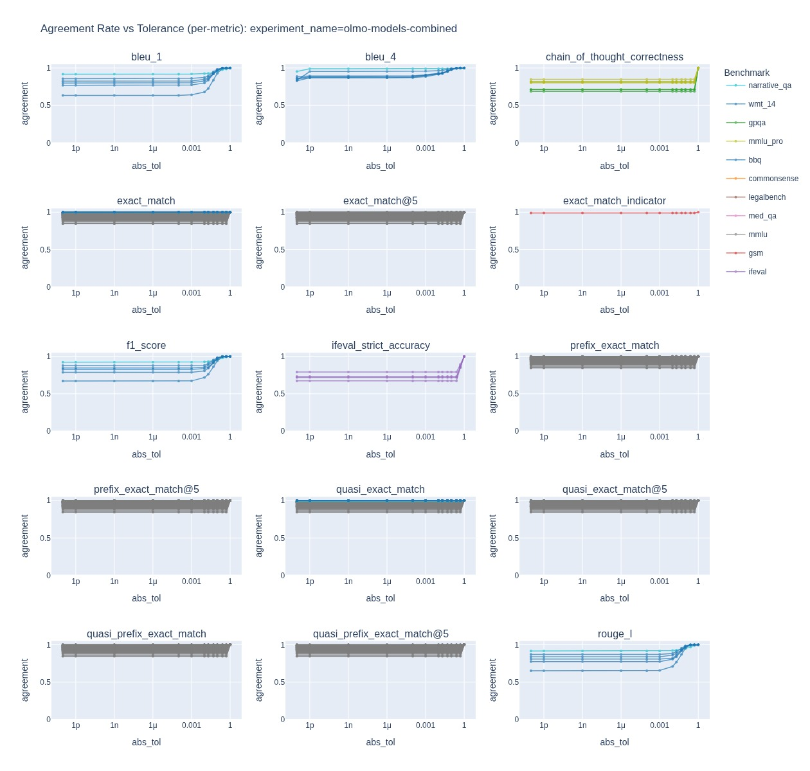
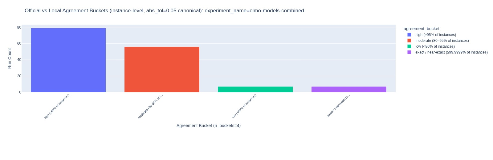
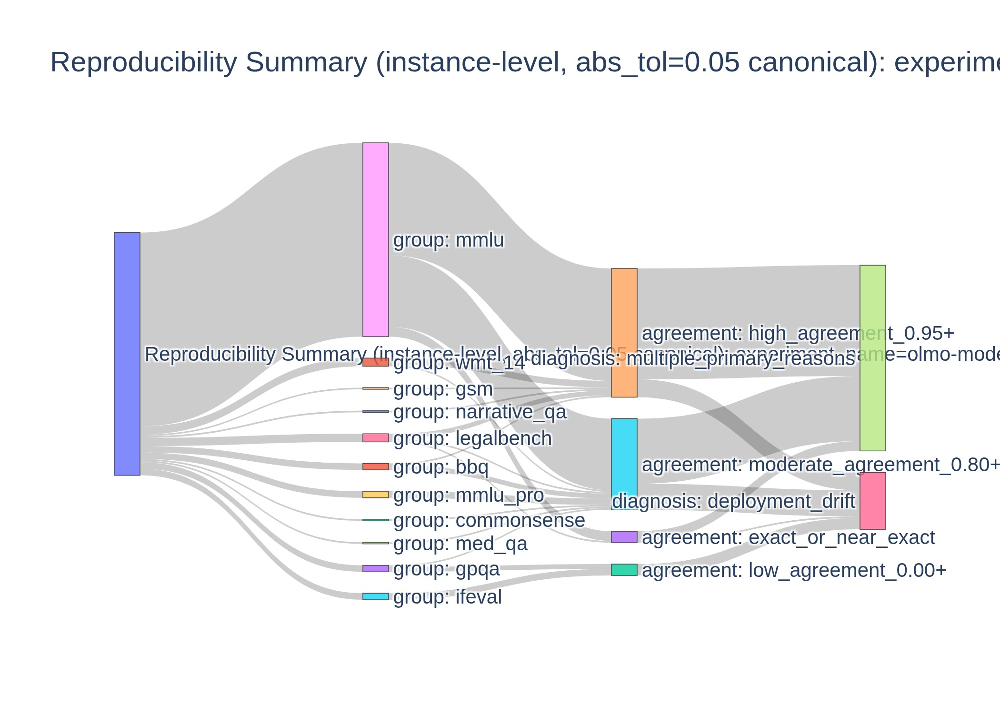
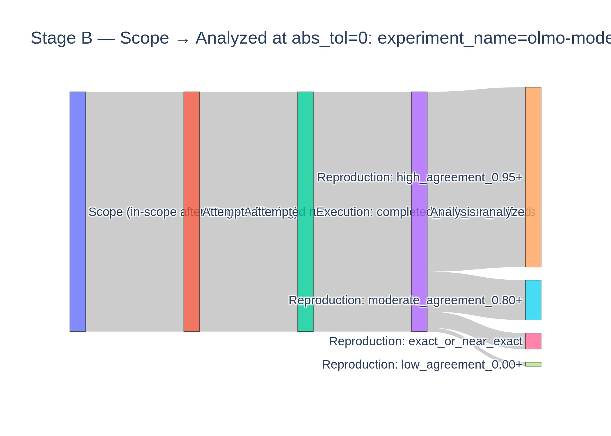
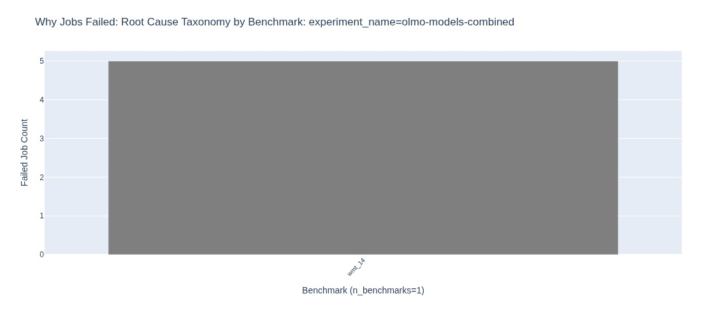

**Named causes found and fixed during this campaign** (decks 06-23, 06-30, 07-08):
OLMo-7B prompt-independent gibberish → tokenizer appending `<|endoftext|>`;
BBQ prompt mismatch → official carries `output_format_instructions=mcqa`, i.e.
genuine recipe drift, not a bug; gpqa gated dataset → HF auth not reaching the
container; ifeval `langdetect` missing → container needs `crfm-helm[all]`;
wmt_14 → wrong `hf_hub` version.

---

### A4. Qwen reproduction — *the largest and cleanest result*

**What.** Eight public Qwen text models replayed from frozen `run_spec.json`.
**Artifacts.** `virtual-experiments/qwen-models-combined` (report **2026-07-20**);
`/data/crfm-helm-audit/audit-qwen-combined-full` — **703 runs with full raw
artifacts on disk**.

**Coverage *(disk)*.** 775 jobs → 703 with artifacts → **703 analyzed (100 % of
completed)**. 72 failures: 56 `missing_math_dataset`, 16 `unknown_failure`.

**Buckets:** high (≥0.95) **474** · exact **159** · moderate 65 · low 5.

**Agreement at abs_tol=0 *(disk, 703 runs)*:** mean **0.975**, median 0.990,
min 0.660, **159 runs at exactly 1.000**.

**Per-benchmark agreement *(disk)*:**

| benchmark | runs | mean | median | min | n at 1.000 |
|---|---|---|---|---|---|
| gpqa | 2 | 0.741 | 0.741 | 0.740 | 0 |
| mmlu_pro | 2 | 0.798 | 0.798 | 0.794 | 0 |
| ifeval | 2 | 0.804 | 0.804 | 0.797 | 0 |
| wmt_14 | 40 | 0.873 | 0.892 | 0.660 | 0 |
| gsm | 8 | 0.916 | 0.947 | 0.823 | 0 |
| narrative_qa | 8 | 0.942 | 0.938 | 0.917 | 0 |
| mmlu_clinical_afr | 66 | 0.961 | 0.980 | 0.864 | 3 |
| winogrande_afr | 22 | 0.976 | 0.979 | 0.944 | 0 |
| legalbench | 40 | 0.978 | 0.993 | 0.706 | 15 |
| med_qa | 8 | 0.987 | 0.988 | 0.973 | 0 |
| **mmlu** | **496** | **0.989** | 0.992 | 0.905 | **138** |
| commonsense | 8 | 0.997 | 0.997 | 0.992 | 3 |
| bbq | 1 | 0.997 | — | — | 0 |

**Aggregate score drift *(disk)*** — mean |diff| **0.0063**, median 0.0020, max
0.0798 over 67 headline cells. **Five times tighter than OLMo.** Same ordering
though: ifeval worst (0.0644), then mmlu_pro (0.0160), gpqa (0.0146).

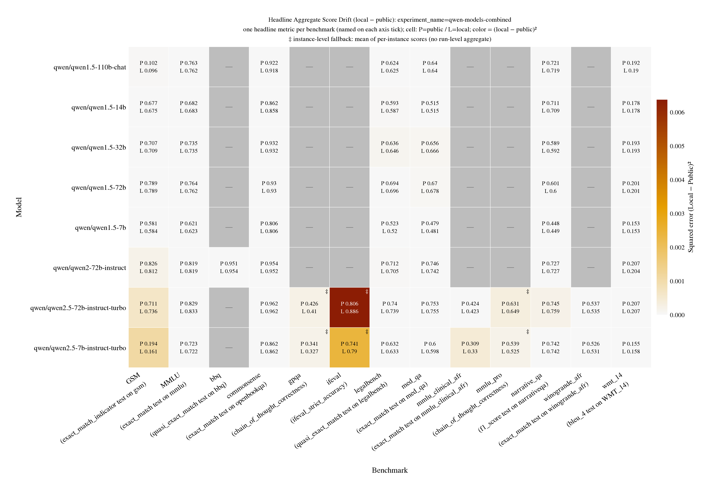
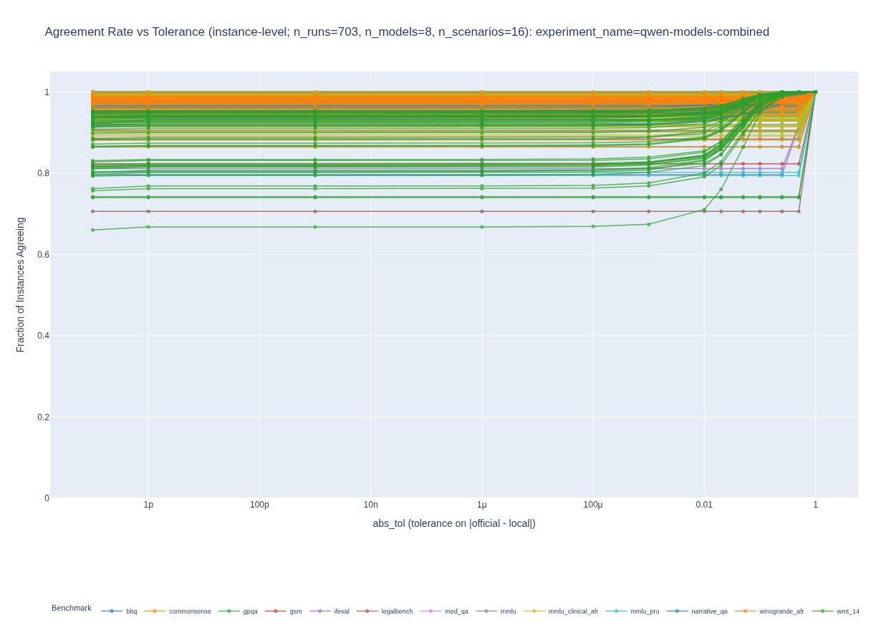
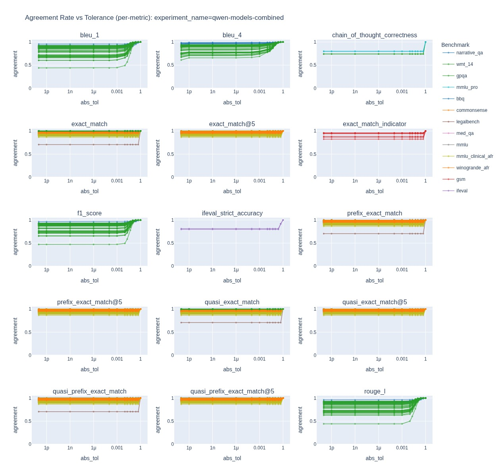
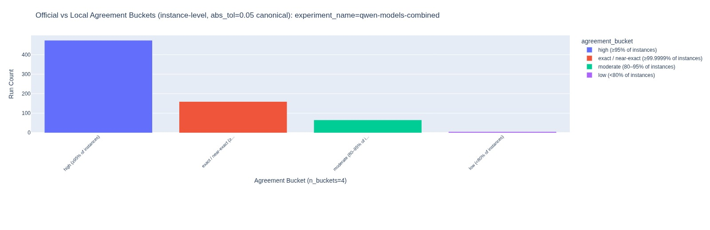
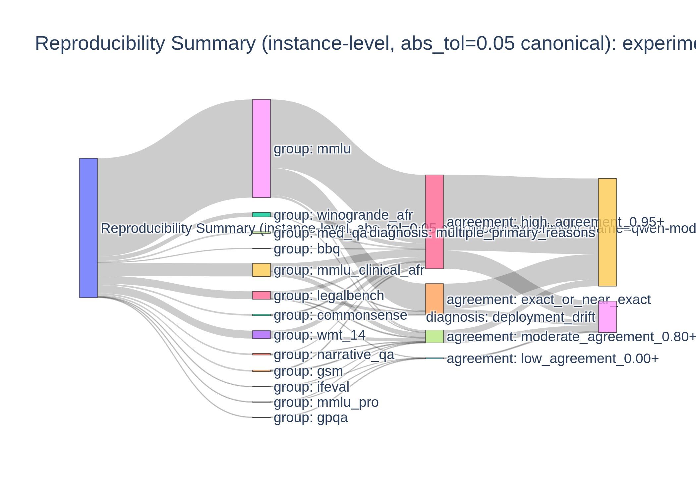
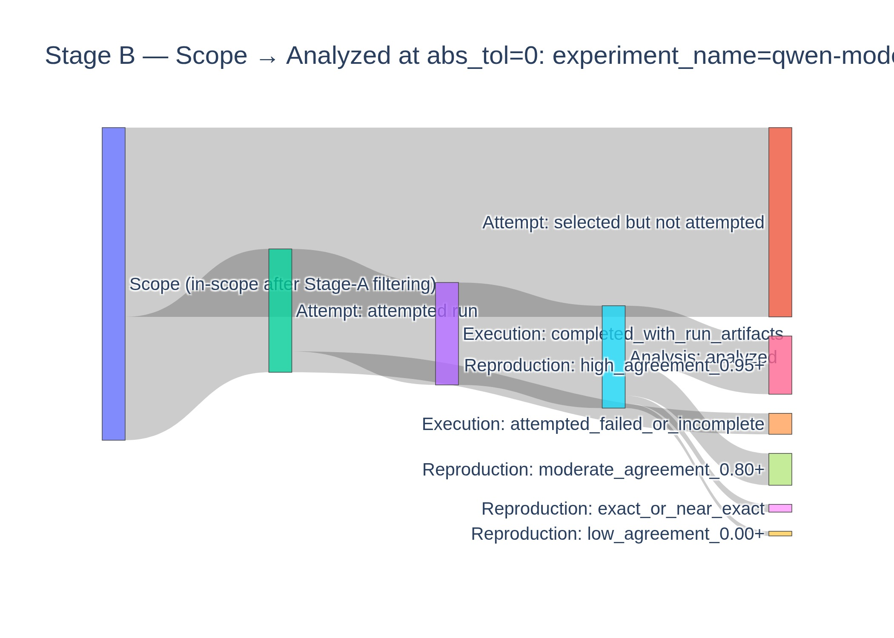
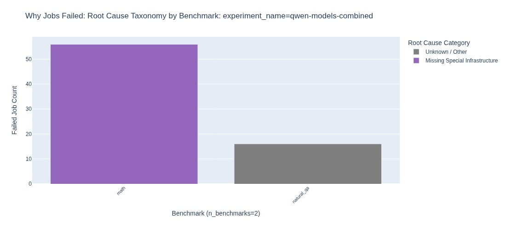

> **This is the strongest positive reproduction evidence in the project, it is
> fresh (2026-07-20), and it is barely mentioned in the master reference.** 703
> analyzed runs, 159 exact, mean agreement 0.975. It deserves to be a headline, not
> a footnote. See §8.1.

---

### A5. GPT-OSS-20B from-spec

**Artifacts.** `virtual-experiments/gpt-oss-20b-from-spec` (report 2026-07-14
17:46 UTC); 4 runs with raw artifacts on disk.

**Coverage.** 12 jobs → 4 with artifacts → 4 analyzed. 8 failures (6 unknown,
2 network/remote-service).

**Agreement:** mean **0.850**, median 0.855, min 0.712 (n=4).

**Score drift *(disk)*, all four cells:**

| benchmark | official | local | diff |
|---|---|---|---|
| bbq | 0.9670 | 0.9630 | −0.0040 |
| mmlu_pro | 0.7400 | 0.7480 | +0.0080 |
| gpqa | 0.5942 | 0.6099 | +0.0157 |
| ifeval | 0.7320 | 0.7535 | +0.0216 |

Mean |diff| 0.0123; mean squared error 1.98e-04.

**The GPT-OSS-vs-OLMo ifeval ratio, verified today.** GPT-OSS ifeval SE =
0.0216² = 4.7e-04. OLMo ifeval SEs = 9.7e-03 … 1.6e-02. **Ratio 21×–33×** — the
master reference's "≈30×" is at the top of that range; "25–35×" as the claim ledger
states is fair, "two orders of magnitude" (the original wording) is not.

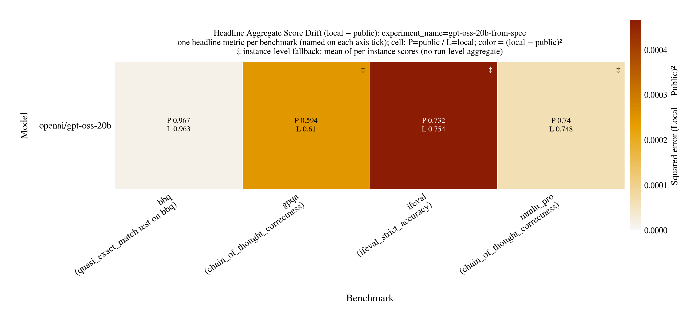
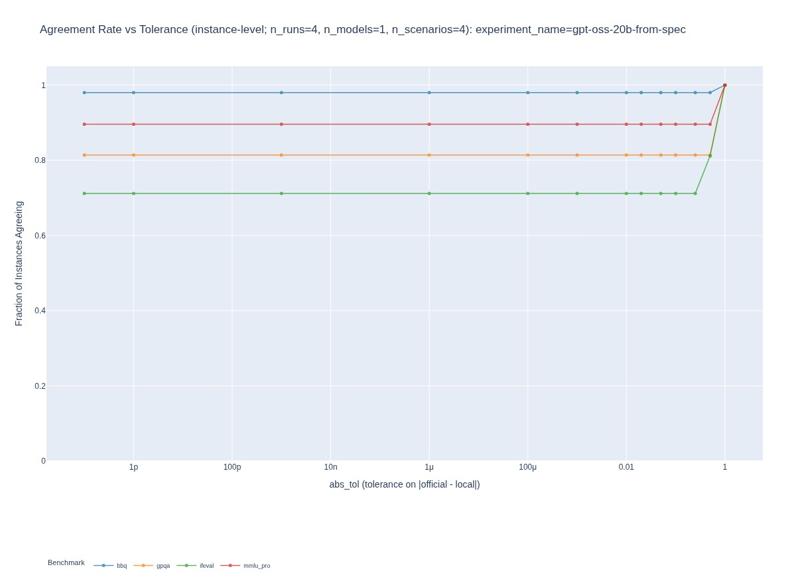
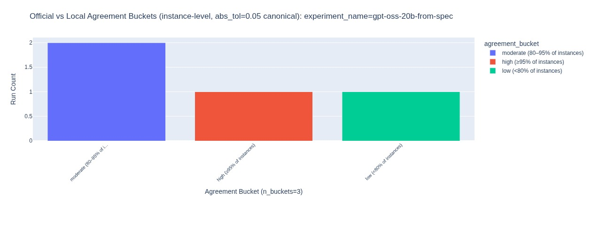
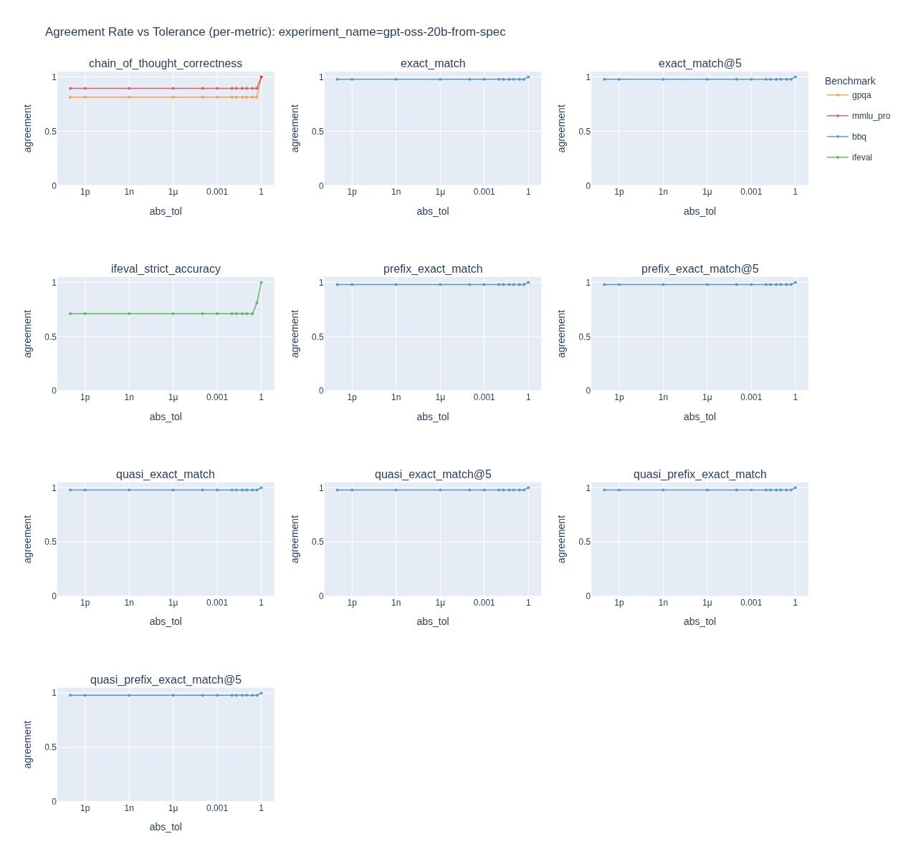
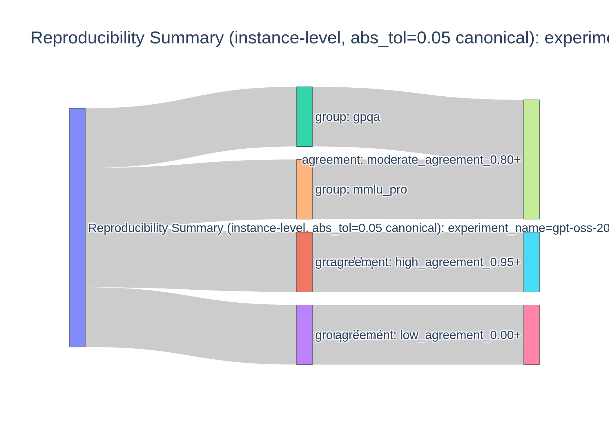
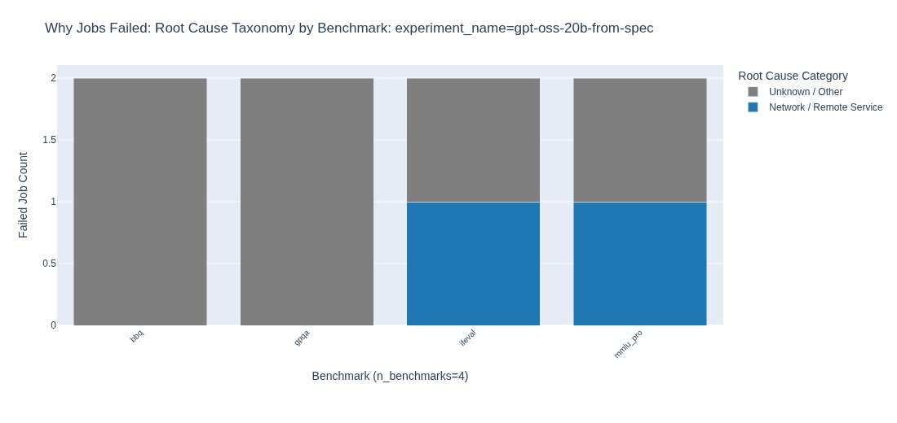

Known engineering cause behind the earlier crash (07-14 deck, resolved): HELM's
null-strip crash was a null-vs-`""` serving difference (Together returns `""`,
vLLM returns `null`).

---

### A6. Era-pinned containers — the classic corpus

**What.** Reproduce pre-v0.5 HELM runs inside version-pinned harness containers, so
the *scorer* is a controlled variable.
**Artifacts.** `virtual-experiments/era-redpajama-v0{24,30}`;
`/data/crfm-helm-audit/era-redpajama_3b-v0_{2_4,3_0}-{full,smoke}` — **16 runs with
raw artifacts, present and preservable** (the only stores the 15d audit found intact).

**Results *(disk)* — identical under both eras:**

| era | run | agreement (abs_tol=0) |
|---|---|---|
| v0.2.4 | `mmlu:subject=us_foreign_policy,…redpajama-incite-base-3b-v1` | **1.000** |
| v0.2.4 | `synthetic_reasoning_natural:difficulty=easy,…` | 0.817 |
| v0.3.0 | `mmlu:subject=us_foreign_policy,…` | **1.000** |
| v0.3.0 | `synthetic_reasoning_natural:difficulty=easy,…` | 0.817 |

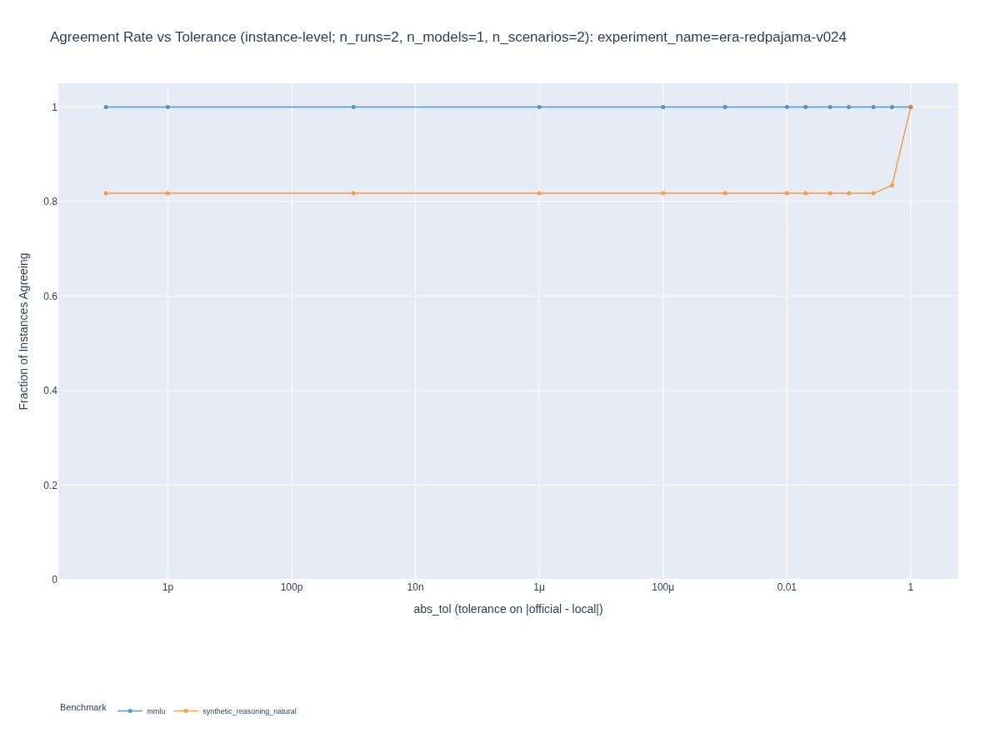

**The two eras agreeing is not two confirmations.** The public artifacts for these
runs are byte-identical across v0.2.4 and v0.3.0 — HELM carried them forward rather
than re-running. Same public numbers, different local instrument.

**G13 (the negative result).** GPT-J 6B / GPT-NeoX 20B / OPT 66B run specs name a
class path (`helm.benchmark.basic_metrics.BasicMetric`) that resolves in **no**
released HELM — a once-migrated hybrid pinning the producing code to unreleased
pre-v0.1.0 HELM (2022-07-31 … 08-26). One `era-gptj_6b-v0_2_4-smoke` directory
exists; no runs. *This is a result, not a gap:* the target is underdetermined.

---

### A7. Deployment-match sweeps

**What.** Serve-and-probe a grid of deployment configurations, score each against
the official completions on a sample, rank.
**Artifacts.** `/data/crfm-helm-audit-store/deployment-match/` — 26 dirs, 19 with a
scored `ranking.txt`, 46+ sweep JSONs.

**All scored sweeps, best cell *(disk)*:**

| sweep | n | cells | best cell | verdict | score | quasi | first-tok |
|---|---|---|---|---|---|---|---|
| olmoe-1b-7b--ifeval-hf | 12 | 96 | fp32 eager agp0 | MATCH | 0.971 | 1.00 | 0.92 |
| olmoe-hf-fp32 | 12 | 2 | fp32 agp0 | MATCH | 0.971 | 1.00 | 0.92 |
| olmo-2-7b--ifeval-vllm | 12 | 64 | fp32 agp0 | MATCH | 0.915 | 0.83 | 1.00 |
| olmo-2-13b--ifeval-vllm | 12 | 64 | fp32 agp0 | MATCH | 0.904 | 0.83 | 1.00 |
| olmo-2-32b--ifeval-vllm | 12 | 64 | **fp32-tp2** agp0 | MATCH | 0.961 | 0.92 | 1.00 |
| **marin-8b--ifeval-chat-vllm** | 12 | 64 | **fp32 agp0 chat** | MATCH | **1.000** | 1.00 | 1.00 |
| marin-8b--ifeval-vllm | 12 | 32 | *(protocol unresolved)* | PARTIAL | 0.158 | 0.00 | 0.42 |
| olmo-2-7b--ifeval-hf | 12 | 96 | fp16/fp32 agp0 | PARTIAL | 0.324 | 0.00 | 0.83 |
| olmo-2-13b--ifeval-hf | 12 | 96 | fp16/fp32 agp0 | PARTIAL | 0.324 | 0.00 | 0.83 |
| olmo-2-32b--ifeval-hf | 12 | 48 | fp16 agp0 | PARTIAL | 0.235 | 0.00 | 0.58 |
| olmo-2-7b--ifeval-hf-fp32 | 32 | 4 | fp32 eager agp0 greedy | **MATCH** | **1.000** | 1.00 | 1.00 |
| olmo-2-13b--ifeval-hf-fp32 | 32 | 4 | fp32 eager agp0 helm | **MATCH** | **1.000** | 1.00 | 1.00 |
| **olmo-2-7b--ifeval-hf-fp32-fullN** | **541** | 16 | fp32 eager agp0 helm | **MATCH** | **1.000** | 1.00 | 1.00 |
| olmo-2-13b--ifeval-hf-fp32-fullN | 541 | — | — | **never ran** | — | — | — |

**Two findings visible only in this table.**

1. **`marin-8b-instruct` — an unreported cross-family confirmation.** fp32 scores
   1.000, fp16 0.909, and `auto`/bf16 collapse to 0.517. Marin has an unpinned
   dtype, so this is the registered "unpinned ⇒ fp32 wins" prediction **confirmed on
   a second family**. The master reference lists this prediction as untested (it was,
   at the time — the first marin sweep silently defaulted to the completions protocol
   and was void; the chat rerun exists and passed). See §8.3.
2. **The old `--ifeval-hf` sweeps are the "residual puzzle," and they are an
   artifact.** Those 96-cell sweeps rank fp32-agp0 at PARTIAL 0.324; the 4-cell
   `-hf-fp32` sweep ranks the *same-named cell* at MATCH 1.000. The difference is a
   bug fix — the probe's `agp`/`ast` arguments were being passed as `0`/`1` where the
   CLI expected `true`/`false` (fixed 2026-07-23, `3307e000`). The old sweeps were
   asking for a configuration they did not get.

---

### A8. The fp32 substrate closure — *the flagship*

**What.** The confirm step the 2026-07-15 consensus demanded, followed by an
engine-attribution probe.
**Artifacts.** `/data/crfm-helm-audit/audit-allenai-olmo-2-1124-{7b,13b}-instruct-ifeval-fp32`
(1 run each, raw artifacts present); the four `hf-fp32` sweeps above.

**Step 1 — ordinary-path float32 replay at full n *(disk)*.** Denominators verified
equal, 1,082 per-instance rows per side per model.

| model | official | local fp32+agp0 (vLLM) | D_fp32 | prior bf16 gap | closed |
|---|---|---|---|---|---|
| OLMo-2-7B-Instruct | 0.6929 | 0.7597 | **+0.067** | +0.098 | 32 % |
| OLMo-2-13B-Instruct | 0.7298 | 0.8121 | **+0.082** | +0.126 | 35 % |

The registered prediction (D_fp32 → 0) was **refuted**. Directionally right,
magnitude wrong. Same closure fraction (~1/3) and same sign on both sizes ⇒
systematic, not noise.

**Step 2 — reproduce on the original engine (HF `transformers.generate`).**
At n=32, all four forward-pass cells MATCH 1.000 on both models.

**Step 3 — full-N verification *(disk, recomputed byte-by-byte today)*.**

| cell (7B, fp32, agp0, decode=helm) | n | byte-identical | ratio |
|---|---|---|---|
| eager, device_map=auto | 541 | **539** | **0.9963** |
| eager, device_map=single | 541 | **539** | **0.9963** |
| eager, agp**1** (modern template) | 541 | 13 | 0.0240 |
| sdpa (all variants) | 20 | 20 | 1.0000 *(incomplete cell)* |

> ⚠️ **The probe's own `exact` score reports 1.000; direct byte comparison gives
> 539/541.** The two non-matching instances (`id13`, `id337`) are long-form
> generations that diverge mid-stream — at character 153 ("his partner Calvert Vaux"
> → "his associate Calvert Vaux") and character 189. These are single-token near-tie
> flips that cascade. **Report 539/541 (99.63 %), not 541/541.** See §8.4.

**Step 4 — attribution.** HF-fp32 with *true greedy* decoding also reproduces the
official, and greedy vs HELM's `do_sample=True, temp=1e-7` produce byte-identical
completions on all 32 probe instances. Decode semantics are therefore **not** the
cause.

**The decomposition:**

| recipe | substrate recovered | ifeval drift vs official |
|---|---|---|
| bf16 + modern chat template | none | **+0.10** |
| vLLM fp32 + old-template rendering | precision, template | **+0.07** |
| HF fp32 + old-template rendering (either decode) | precision, template, **engine** | **≈ exact** (539/541) |

Same weights, same float32, same prompt, same greedy decode — only vLLM vs
Hugging Face — moves a published benchmark metric by +0.067/+0.082.

**Not established:** one benchmark, one family, two sizes, instruct-only;
completion-level evidence, not a metric-level in-process HELM run; the sign of the
residual is characterized, not explained.

---

### A9. Qwen3.5-9B-Base extension — *runs complete, no report built*

**What.** The first **compute** experiment: a model with no public HELM entry,
evaluated on the same 9-group core roster as the Qwen reproductions.
**Artifacts.** `/data/crfm-helm-audit/audit-qwen35-9b-base-vllm-full` — **72 runs,
72 `stats.json`, complete, dated 2026-07-16/17.** No virtual experiment exists.

**Results, read straight from `stats.json` *(disk — published here for the first
time)*:**

| benchmark | metric | runs | mean | min | max |
|---|---|---|---|---|---|
| mmlu (57 subjects) | exact_match | 57 | **0.8098** | 0.5300 | 0.9637 |
| commonsense | exact_match | 1 | 0.9480 | — | — |
| gsm | exact_match_indicator | 1 | 0.8060 | — | — |
| med_qa | exact_match | 1 | 0.7237 | — | — |
| legalbench | exact_match | 5 | 0.6668 | 0.4578 | 0.8184 |
| narrative_qa | f1_score | 1 | 0.2688 | — | — |
| wmt_14 | bleu_4 | 5 | 0.1988 | 0.1156 | 0.2478 |
| boolq | exact_match (valid) | 1 | 0.4760 | — | — |

**Beside the reproduced Qwen1.5-7B baseline** — the comparison this grid was built
for, assembled here for the first time (Qwen1.5-7B column = *local reproduction*
from A4, so both sides are our own instrument):

| benchmark | Qwen1.5-7B (reproduced) | Qwen3.5-9B-Base | Δ |
|---|---|---|---|
| mmlu | 0.623 | **0.810** | +0.187 |
| gsm | 0.584 | **0.806** | +0.222 |
| commonsense | 0.806 | **0.948** | +0.142 |
| med_qa | 0.481 | **0.724** | +0.243 |
| legalbench | 0.520 | **0.667** | +0.147 |
| narrative_qa (f1) | 0.449 | 0.269 | **−0.180** |
| wmt_14 (bleu_4) | 0.153 | **0.199** | +0.046 |

> ⚠️ **This table is indicative, not final.** The two sides are computed
> differently: the Qwen1.5-7B column is HELM's *aggregate* headline metric, while
> the Qwen3.5 column is my *mean over per-subject runs* (57 for mmlu, 5 for
> legalbench and wmt_14). Those coincide only if subject sizes are equal, which they
> are not. Building the virtual experiment (§5 item 1) computes both sides the same
> way and supersedes this table. The direction and rough magnitude will hold; the
> third decimal will not. **`narrative_qa` is the one regression, and the next table
> explains it.**

**`<think>`-tag leakage across the whole grid *(disk, computed today; unperturbed
instances only)*.** A base model emitting reasoning-format tags on a plain
completions prompt — pretraining contamination with reasoning-format data, surfacing
as a scoring failure:

| benchmark | instances | with `<think>` | rate |
|---|---|---|---|
| **narrative_qa** | 470 | 322 | **68.5 %** |
| **boolq** | 1,000 | 502 | **50.2 %** |
| mmlu | 14,869 | 0 | 0.00 % |
| wmt_14 | 5,000 | 0 | 0.00 % |
| med_qa | 1,000 | 0 | 0.00 % |
| legalbench | 2,047 | 0 | 0.00 % |
| gsm | 1,000 | 0 | 0.00 % |
| commonsense | 500 | 0 | 0.00 % |

**The split is perfectly clean: leakage fires only on the two free-form generation
tasks and is exactly zero on every constrained-answer shape**, across 24,416
instances. It is not a property of the prompt content either — the boolq
perturbation arms (mild_mix, dialect, gender, person_name) leak at the same 52 %
overall rate as canonical.

Consequences: boolq's 0.476 and narrative_qa's 0.269 are **upper bounds depressed by
a measured format-leakage rate**, not capability measurements — with
`max_tokens=5`, a `<think>` prefix destroys the boolq answer outright. There were
zero empty completions, so the newline-tolerant client did its job and this is a
different, residual failure mode. Two things follow for the extension study: report
these two cells with the leakage rate attached, and note that the same recipe run
against an *instruct* model would not show it — which makes leakage rate a
measurable property of the base/instruct boundary rather than a bug to fix.

> **Gap:** one `eval-audit-build-virtual-experiment` invocation away from a full
> report with plots. Nobody has run it. The numbers above are hand-extracted.

---

### A10. Early / pre-split experiments

29 experiment-analysis trees under
`/data/crfm-helm-audit-store/reports/core-run-analysis/` (generated 2026-05-20 and
2026-05/06). Most predate the repository split and the from-spec refactor.

| experiment | run entries | reports built | note |
|---|---|---|---|
| `audit-historic-grid` | 286 | **56** | gpt2 (44), sea-lion (10), granite, +1 |
| `audit-qwen25-7b-aiq` | 137 | **65** | qwen2.5-7b-instruct-turbo across 10 families |
| `audit-gpt-oss-20b-vllm-smoke` | 2 | 2 | |
| `audit-small-models-kubeai-overnight` | 8 | 0 | all skipped |
| pythia/vicuna r1/r2 pairs (boolq, mmlu-usfp, narrative) | 1 each | 0 | repeatability pairs, reports never built |
| `audit-vicuna-nochat-{overnight,server}` | 3 each | 0 | |

Also on disk with raw artifacts but **no analysis at all**:
`audit-falcon-7b-helm-grid` (41 runs, 2026-04/05) and
`audit-gpt-oss-20b-core-grid` (40 runs, 2026-05).

**These are the repeatability and cross-machine baselines** (r1/r2 pairs = same
recipe twice). They were run, the artifacts survive, and the reports were never
built. Cheap to recover.

---

## 3. Thread B — open-weight judges

### B1. Identity-replay gate (artifact reconstruction)

**What.** Reattach the *original* judge annotations to a reconstructed scenario
state, run the *real* official metric, and require the published statistics back to
1e-12. Pure reconstruction — no model execution.
**Artifact.** `/data/crfm-helm-audit-store/open-judge/replay-report.json`.

**Results *(disk)* — 6/6, zero failures:**

| benchmark | max abs error | aggregate rows | instance rows |
|---|---|---|---|
| xstest | **0.000e+00** | 15 | 2,250 |
| omni_math | **0.000e+00** | 3 | 1,000 |
| harm_bench | **0.000e+00** | 15 | 2,000 |
| simple_safety_tests | **0.000e+00** | 15 | 500 |
| anthropic_red_team | **0.000e+00** | 15 | 5,000 |
| wildbench | 1.954e-14 | 6 | 2,000 |

Source audit: 6 runs examined, 6 supported, 0 unsupported (candidate
`openai/gpt-oss-20b`).

> These are the cheapest, most citable, and most easily preserved artifacts in the
> entire project — and they are unhashed and unbundled.

### B2–B3. Judge substitution and the size sweep

**Artifacts.** 75 attempt directories, all `DONE`, under
`/data/crfm-helm-audit-store/open-judge/results/`. Grid *(disk)*:

| benchmark | 0.8B | 2B | 4B | 9B | 27B | 35B-A3B |
|---|---|---|---|---|---|---|
| xstest (450) | 3×450 | 3×450 | 3×450 | 3×450 | 3×450 | 3×450 |
| wildbench (1000) | 3×1000 | 3×1000 | 3×1000 | 3×1000 | 3×1000 | 3×1000 |
| anthropic_red_team (1000) | — | 3×1000 | 3×1000 | 3×1000 | — | — |
| harm_bench (400) | — | 3×400 | 3×400 | 3×400 | — | — |
| simple_safety_tests (100) | — | 3×100 | 3×100 | 3×100 | — | — |
| omni_math | — | — | — | — | — | — **never run** |

*(cells = replicates × instances; 3 replicates at temperature 0 throughout)*

**Scores and parse rates, computed from the artifacts today *(disk)*:**

| benchmark | official | judge | score (mean of 3 reps) | sd across reps | parse ok |
|---|---|---|---|---|---|
| xstest | 0.8717 | 0.8B | 0.8244 | 0.0022 | 1.000 |
| | | 2B | 0.8630 | 0.0013 | 1.000 |
| | | 4B | 0.9423 | 0.0079 | 0.874 |
| | | 9B | 0.8766 | 0.0053 | 0.982 |
| | | 27B | 0.8690 | 0.0014 | 0.996 |
| | | 35B-A3B | 0.8691 | 0.0006 | 0.999 |
| wildbench | 7.6363 | 0.8B | 3.9752 | 0.1037 | **0.141** |
| | | 2B | 7.2537 | 0.0221 | 0.589 |
| | | 4B | 6.9103 | 0.0231 | 0.685 |
| | | 9B | 6.5236 | 0.0160 | 0.919 |
| | | 27B | 6.7040 | 0.0249 | 0.841 |
| | | 35B-A3B | 6.8398 | 0.0179 | 0.980 |
| anthropic_red_team | 0.9965 | **2B** | **0.2549** | 0.0032 | **0.999** |
| | | 4B | 0.9997 | 0.0003 | 0.942 |
| | | 9B | 0.9996 | 0.0001 | 0.990 |
| harm_bench | 0.9869 | 2B | 0.9604 | 0.0071 | 1.000 |
| | | 4B | 0.9861 | 0.0009 | 0.838 |
| | | 9B | 0.9897 | 0.0020 | 0.934 |
| simple_safety_tests | 1.0000 | 2B | 0.6500 | 0.0000 | 1.000 |
| | | 4B | 1.0000 | 0.0000 | 0.977 |
| | | 9B | 1.0000 | 0.0000 | 1.000 |

**Agreement analysis (v1 arms, 2026-07-19 report):**

*xstest (label metric, n=450):*

| pair | signed | abs | pearson | within | **kappa** |
|---|---|---|---|---|---|
| qwen3.5-27B vs official GPT | +0.0093 | 0.0115 | 0.958 | 98.4 % | **0.936** |
| qwen3.6-35B-A3B vs official GPT | +0.0117 | 0.0117 | 0.959 | 98.2 % | **0.928** |
| qwen3.5-27B vs qwen3.6-35B | −0.0024 | 0.0043 | 0.993 | 98.7 % | 0.944 |
| *official GPT vs official Llama* | −0.0300 | 0.0300 | 0.895 | 96.0 % | ***0.829*** |

**Open-vs-closed disagreement is smaller than the closed ensemble's internal
disagreement.**

*wildbench (1–10 rubric, n≈962–999):*

| pair | signed | abs | pearson | spearman | within |
|---|---|---|---|---|---|
| qwen3.5-27B vs official GPT | −0.8228 | 1.2337 | 0.826 | 0.656 | 63.6 % |
| qwen3.6-35B vs official GPT | −0.7313 | 1.0188 | 0.872 | 0.700 | 70.5 % |
| qwen3.5-27B vs qwen3.6-35B | −0.0869 | 0.6635 | 0.935 | 0.879 | 83.0 % |
| *official GPT vs official Llama* | −0.1271 | 0.6306 | 0.936 | 0.687 | 91.4 % |

**Replicate behaviour at temperature 0** — xstest: sd 0.0005, 0.2 % of instances
change score. wildbench: sd 0.2145, **38.7–42.6 % of instances change**, max range
5–6 points. Judge *text* differs across replicates on 87–96 % of instances either
way. Judge non-determinism is universal; **metric fragility is a property of the
metric.**

**Three caveats that must travel with these numbers.**
1. **Single candidate.** Every artifact scores `gpt-oss-20b`. Every endpoint of
   interest (ranking preservation, conclusion survival) is defined over a *set*.
2. **Parse ≠ calibration.** Qwen3.5-2B: 99.9 % parse, score 0.2549 against an
   official 0.9965 on red-team — a label inversion that any format-based health
   check passes. Safety sets are ~99 % one-class, so "agreement" there is
   essentially a false-positive rate.
3. **Contamination.** Qwen3.5 launched 2026-02-16; the HELM Safety v1.14.0 /
   Capabilities v1.12.0 publication dates could not be established. Every agreement
   figure is an **upper bound**.

**Stale:** the only stored analysis reports are the two 2026-07-19 pre-sweep files
(27B and 35B-A3B only). The 4 later benchmarks and 4 smaller judges have never been
run through `30_analyze_judges.sh`. The table above is my recomputation from raw
artifacts; agreement/kappa for those arms does not exist anywhere yet.

---

## 4. Thread C — efficient benchmarking

Ran 2026-06-02 → 06-23, then paused when attention returned to reproduction. Results
exist **only in the decks** and in `/data/dkps-embeddings` (19 GB of cached
embeddings). Sibling repos `mrmr_eval` / `dkps` hold the code.

**C1 — mRMR tutorial replication.** Datasets `[legalbench, math, med_qa, wmt_14]`;
reference models `[20, 30, 40, 50]`; coreset `[5, 10, 15] %`; 12 methods
(mRMR MIQ, gp-IRT, Lasso, Search+, AnchorPoints±, random baselines, kernel variants).
Metrics: RMSE, MAE, Kendall τ, Spearman ρ.

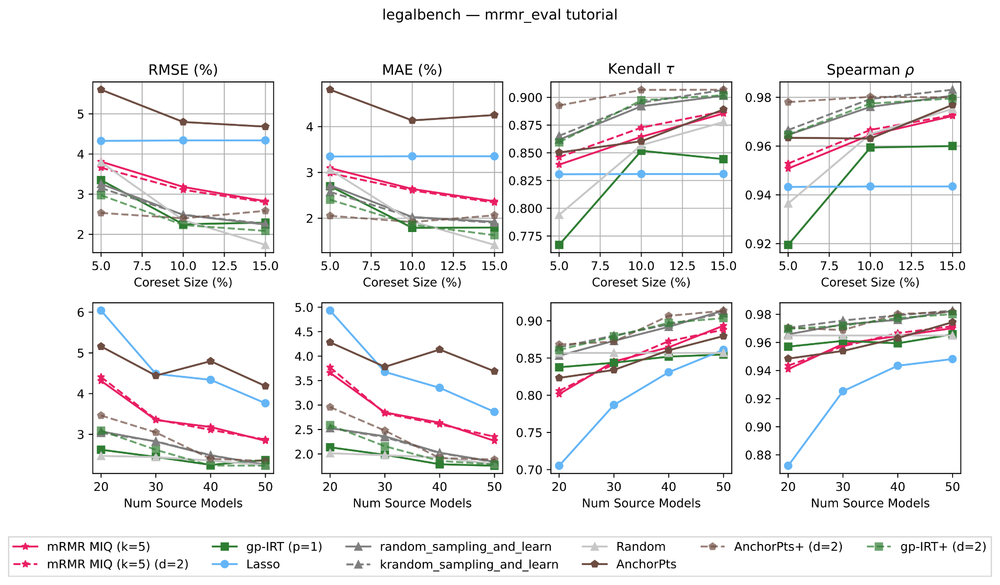
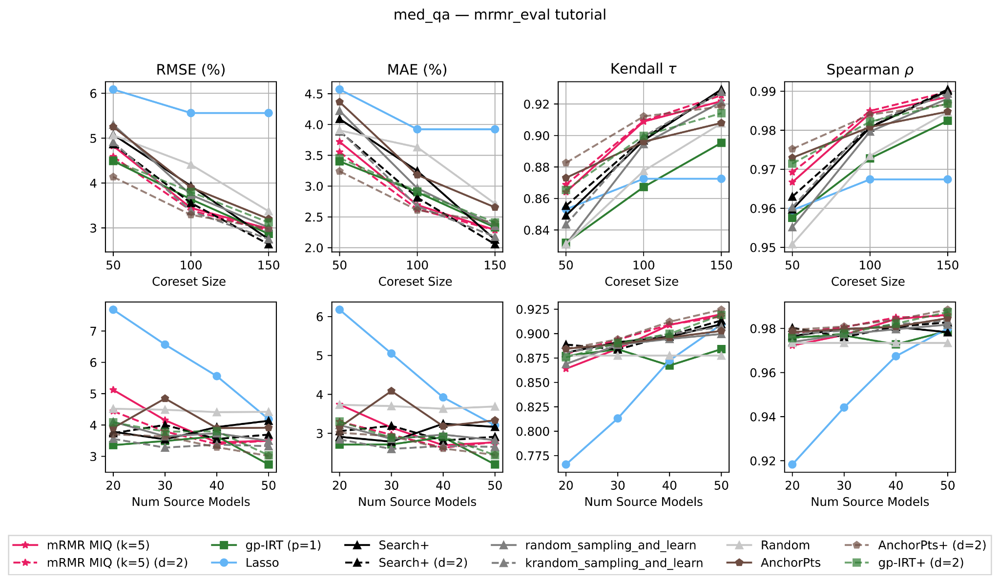
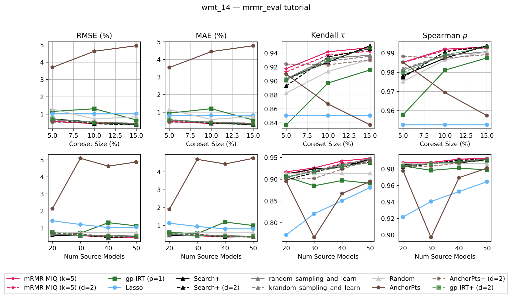
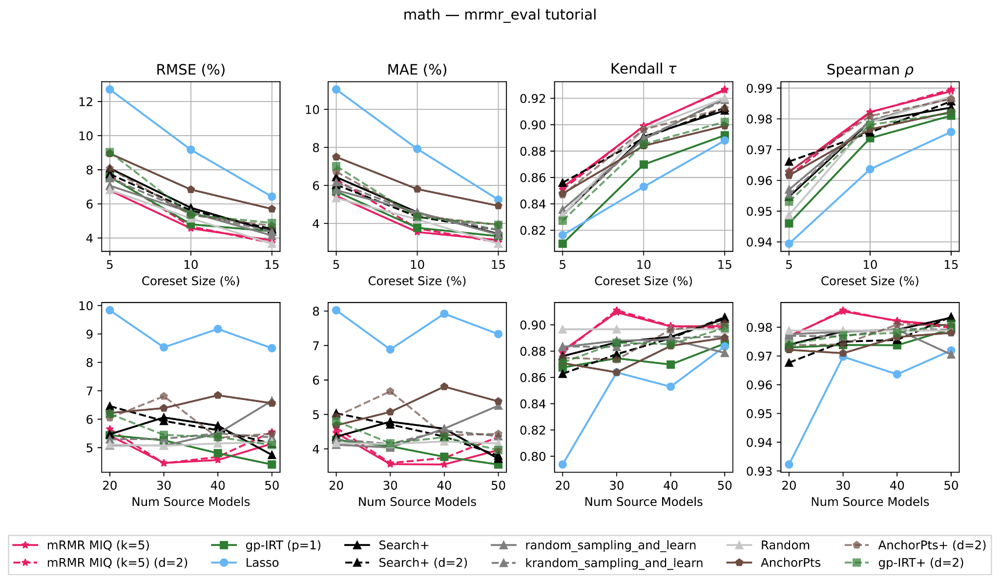

**C2 — DKPS vs baselines** (06-23 deck, med_qa, DKPS one-hot + 8-D MDS):

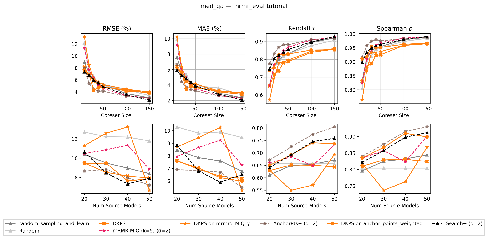

**Findings as recorded (deck 06-16 slide 12, 06-23 slide 6):**
- At 20 models / ~50 queries the feature-selection methods **beat** DKPS.
- DKPS improves with more source models; the others do not necessarily.
- mRMR is **extremely slow** on continuous-score benchmarks (wmt_14).
- med_qa one-hot encoding is >5-D because not all models answer in-format — a
  representation problem, and one-hot exposes far less than text encoding.
- Tutorial code runs each (method × coreset × n_models) cell only **3 times** — too
  few replicates to separate close methods.

**Status: proposal, not result.** The active-selection method (DKPS + mRMR),
adaptive benchmarking, and the ensemble idea were designed and never run.

---

## 5. Everything that ran but produced no analysis

Ordered by cheapness of recovery. All raw artifacts are on disk.

| # | What | Runs | What is missing | Cost |
|---|---|---|---|---|
| 1 | **Qwen3.5-9B-Base core grid** | 72 | virtual experiment + report | one command |
| 2 | **Judge analyses for 4 benchmarks × 4 judge sizes** | 63 attempts | `30_analyze_judges.sh` per benchmark | minutes, zero GPU |
| 3 | `audit-falcon-7b-helm-grid` | 41 | any analysis at all | one command |
| 4 | `audit-gpt-oss-20b-core-grid` | 40 | any analysis at all | one command |
| 5 | **Repeatability pairs** (pythia/vicuna r1 vs r2) | 12 | reports never built | one command each |
| 6 | `audit-allenai-olmo-7b-mmlu-full` / `olmo-1-7-7b-full` | 114 + 114 | folded into combined? unclear | check |
| 7 | 13B full-N HF-fp32 probe | 0 | oracle snapshotted, no cells run | ~1 GPU-hour |
| 8 | Omni-MATH rejudge | 0 | never run; annotator never live-tested | GPU |

---

## 6. Preservation status *(disk, verified today)*

| store | raw run artifacts on this host | note |
|---|---|---|
| `audit-qwen-combined-full` | **703 / 703** | complete |
| `audit-allenai-olmo-combined-full` | **73 / 73** | complete |
| `audit-openai-gpt-oss-20b-from-spec-full` | **4 / 4** | complete (Jul 14) |
| `era-redpajama_3b-v0_{2_4,3_0}-*` | **16 / 16** | complete |
| `audit-*-ifeval-fp32` (7B, 13B) | **2 / 2** | complete (Jul 22) |
| `audit-qwen35-9b-base-vllm-full` | **72 / 72** | complete |
| deployment-match sweeps | 19 scored + 46 sweep JSON | complete |
| open-judge snapshots + attempts | 6 snapshots, 75 attempts | complete |
| **Total** | **1,634 runs** | |

**Nothing is hashed or bundled.** Every experiment directory pairs 1:1
`run_spec.json` ↔ `scenario_state.json` — I checked all 74. See §8.1 for why this
contradicts the master reference.

---

## 7. Figure index

All figures in [`figures/`](figures/), copied from the report trees. Regenerate any
of them with the `redraw_plots.sh` next to its source.

| file | source |
|---|---|
| `{olmo,qwen,gpt-oss-20b}_score_drift_headline.png` | `…/level_001/aggregate_score_diff/` |
| `{olmo,qwen,gpt-oss-20b}_agreement_curve.jpg` | `…/aggregate-summary/` |
| `{olmo,qwen,gpt-oss-20b}_agreement_curve_per_metric.jpg` | ″ |
| `{olmo,qwen,gpt-oss-20b}_reproducibility_buckets.jpg` | ″ |
| `{olmo,qwen,gpt-oss-20b}_sankey_reproducibility.jpg` | ″ |
| `{olmo,qwen}_sankey_scope_to_analyzed.jpg` | ″ |
| `{olmo,qwen,gpt-oss-20b}_failure_taxonomy.jpg` | ″ |
| `olmo_drift_ifeval.png` | `…/aggregate_score_diff_per_metric/` |
| `era_redpajama_v0{24,30}_agreement_curve.jpg` | era virtual experiments |
| `e2e-phi2-{hf,vllm,incomparable}_core_metric_report.png` | e2e core reports |
| `threadB_mrmr_*.png`, `threadB_dkps_*.png` | decks 06-16 / 06-23 (exist nowhere else) |

Not copied but available: ~8,900 further plots, notably
`qwen-models-combined` (6,129) and `olmo-models-combined` (1,555), including
per-metric drift heatmaps and per-run core-metric reports; and the interactive
`.html` sankeys beside every `.jpg`.

---

## 8. Discrepancies found while compiling this

**Read this section before citing anything above.** Four disagreements between the
master reference and what is on disk today. Three of them make the project's
position *better* than the written record says.

### 8.1 The flagship stores are NOT pruned on this host — preservation is cheap

The 2026-07-15d audit reported `gpt-oss-20b-from-spec` and `olmo-models-combined` as
**"ABSENT (pruned; 0 scenario_state)"** and concluded that "regenerate" means
**re-run**. That conclusion is carried into the master reference, the claim ledger,
and the strategy addendum as the most urgent open item.

**On this host today, both stores are complete**: GPT-OSS 4/4 scenario_state,
OLMo-combined 73/73, and 1,634 runs in total across all 74 experiment directories,
every one pairing 1:1 with its `run_spec.json`. The GPT-OSS artifacts are dated
2026-07-14 09:29–13:19 — i.e. they were on disk *before* the audit ran.

The likely explanation is that the audit inspected a different root (it ran on
`aiq-gpu`; this is the workstation mirror, which received a 315 GB pull on
2026-07-22). Either way the **actionable conclusion inverts**: preservation is
copy-and-hash from this host, not a re-run campaign. This should be checked on
`aiq-gpu` and the store ledger corrected.

### 8.2 The "59 % classic-track" figure is not supported by the inventory

The master reference carries ≈59 % of the corpus as classic-track, flagged
`internal-estimate`. The inventory says **classic is 8,377 / 34,512 = 24.3 %** of
run records (159 of 1,109 selected = 14.3 %). Either the 59 % refers to a different
denominator or it is wrong. Do not publish it before regenerating.

### 8.3 The marin cross-family confirmation already exists

The master reference records the marin-8b registered prediction as *untested* (the
first sweep was void — the protocol resolver silently defaulted to completions). The
chat-protocol rerun **exists on disk and passed**: fp32 MATCH 1.000, fp16 0.909,
auto/bf16 PARTIAL 0.517. That is the "unpinned dtype ⇒ fp32 wins" prediction
confirmed on a **second family**, which is exactly what Task A of the task queue was
created to obtain. Also note the 7B **full-N** probe ran (§8.4) — the master
reference lists it as an optional open item.

### 8.4 "541/541 byte-exact" should be 539/541

The full-N probe's `ranking.txt` reports `exact 1.00`, and the journals predict
541/541. Direct byte comparison of completions against the oracle gives
**539/541 (99.63 %)** for every complete cell. Two long-form instances diverge
mid-generation. At n=32 it genuinely is 32/32 — the two misses are outside that
sample. The claim survives comfortably (chance agreement is ~0) but the number in
the paper must be 539/541, and the two divergences are worth a sentence: they are
exactly the near-tie token flips the thesis predicts, showing up *within* the
recovered configuration.

**Also worth noting, in the project's favour:** the OLMo headline table on disk shows
MMLU olmo-7b **0.295/0.287**, the corrected dedupe value — not the stale 0.295/0.144
the master reference says is still on disk. That store was regenerated
2026-07-14 12:27 local.

---

## 9. Suggested next steps

**Free (no GPU), highest value first**
1. Build the Qwen3.5 report (§A9) — a complete extension result is sitting in raw form.
2. Re-run the judge analyses for the 4 newer benchmarks and 4 smaller judges (§B3) —
   the agreement/kappa numbers for two-thirds of the grid do not exist yet.
3. Copy + hash everything (§6, §8.1) — and correct the store ledger.
4. Build reports for falcon-7b, gpt-oss-core-grid, and the repeatability pairs (§5).
5. Regenerate the corpus denominator from a checked-in manifest (§8.2).

**Cheap GPU**
6. Finish the 13B full-N probe (§A7) — one cell, ~1 GPU-hour.
7. Cross-family sweep: pythia-6.9B, vicuna-7B, granite-4.0-micro as treatment,
   gemma-2-9b-it (pinned bf16) as bidirectional control. **marin is already done and
   confirms** (§8.3).

**The real gap**
8. The prospective census — frozen sampling rule, frozen diagnostic ladder, outcome
   buckets defined in advance. Everything above is one deep case (A8) plus broad
   agreement statistics (A3/A4/A5). Neither is a population claim, and no amount of
   further per-experiment work turns them into one.
9. Candidate expansion for the judge study — every endpoint needs a *set* of
   candidates, and the corpus already holds official responses and judgments for the
   whole leaderboard, so this costs judge inference only.
